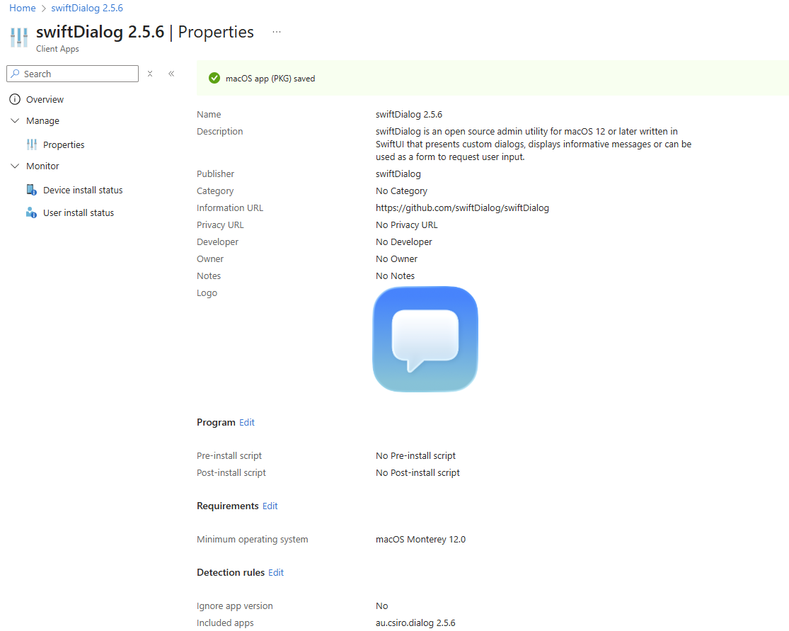
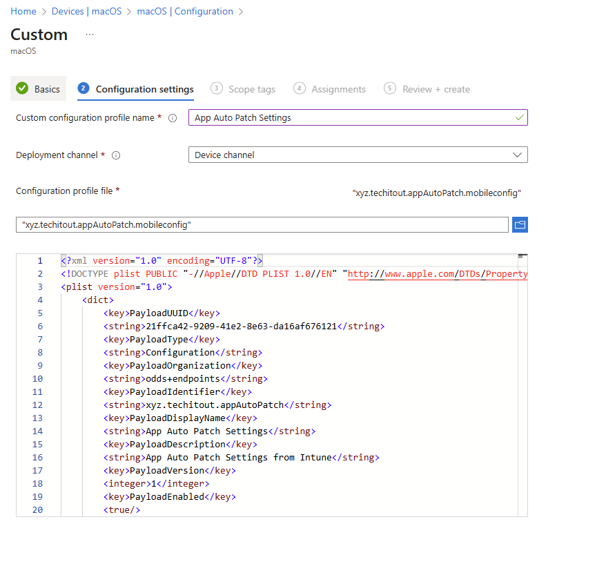
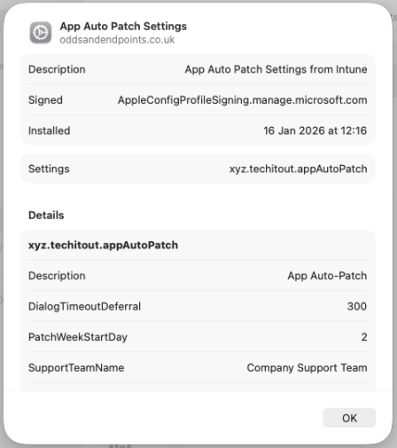
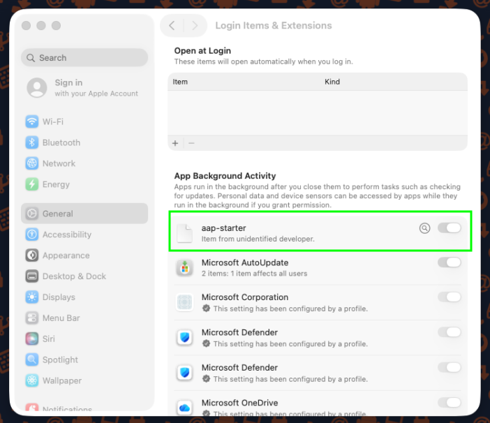
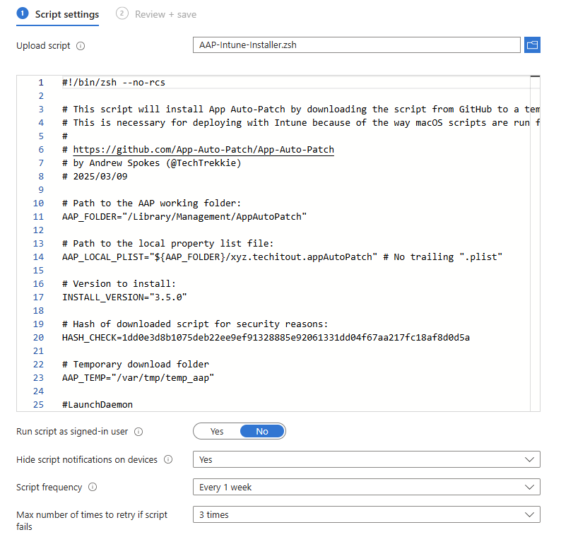
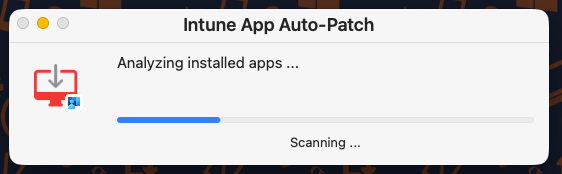
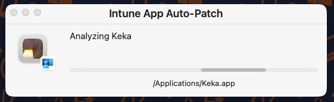
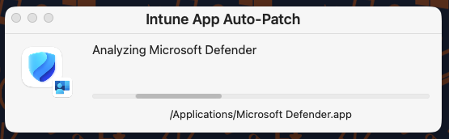
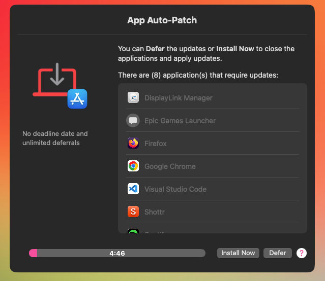
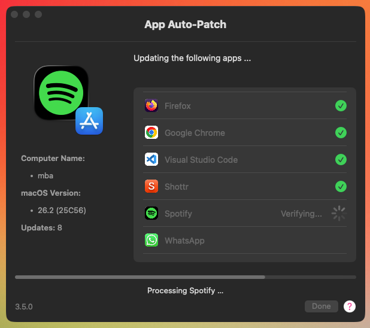

# Keeping macOS Apps updated with App Auto-Patch and Intune

One thing I've learned over the last 18 months or so, is just how congested the app management space is for Intune enrolled Windows and macOS devices; with everyone clambering to have the best offerings, unified portals, cloud-first approach, or latest functionality.

What about keeping these apps up to date? There must be easier ways than pushing the new versions of apps from MDM solutions?

And what's wrong with just using Intune and some open-source software to make sure your devices are running current software?

Well nothing, if it's good enough for [Jamf](https://www.jamf.com/) it's certainly good enough for Intune.

## Auto App-Patch

There are a handful of options to support the update of applications already installed on macOS devices, one of those is [Auto App-Patch](https://github.com/App-Auto-Patch/App-Auto-Patch) which leans on, and adds to the functionality of [Installomator](https://github.com/Installomator/Installomator), and using [swiftDialog](https://github.com/swiftDialog/swiftDialog) can provide users with notifications and interactive messages when updating a set list of apps on the devices.

So how do we get Auto App-Patch configured and deployed to our Intune enrolled devices, making sure we're not exposing our environments to app-based security vulnerabilities?

### User Interaction

First off, and importantly, if we want our end users to see what App Auto-Patch is doing, and give them the option to install or defer any app updates (because they're busy little bees), then we need a way to display notifications and update progress to them.

As mentioned, App Auto-Patch uses [swiftDialog](https://github.com/swiftDialog/swiftDialog) for these notifications, so we just need to make sure that our macOS fleet (*Is "fleet" a mac thing? I've always used "device estate"*), has this app installed, so off you trot and download the swiftDialog installer from the [releases](https://github.com/swiftDialog/swiftDialog/releases) page, and quickly punt it into Intune and deploy it to your "fleet" ([One of us, one of us](https://www.youtube.com/watch?v=39Bnk6VU53Y)).

With the app installing (to test devices first), we can now look at the App Auto-Patch configuration settings, that configure update and installation behaviour.


The **InteractiveMode** setting within the App Auto-Patch configuration settings is the reason we needed to install swiftDialog, if you configure this setting to anything other than **0**, App Auto-Patch will use swiftDialog to display information to your users.


## App Auto-Patch Settings

User notifications sorted, we're going to trawl through the available [config settings](https://github.com/App-Auto-Patch/App-Auto-Patch/wiki/Configure-Settings#mdm-configuration-profile) for App Auto-Patch and pull out the ones we need as a minimum to ensure that our macOS fleet are running up to date apps.

For now we'll focus on just getting **all** apps updated; so with that in mind, we'll need to create a new mobileconfig file and deploy it as a [custom policy](https://learn.microsoft.com/en-us/intune/intune-service/configuration/custom-settings-macos) in Intune, with the combined settings in the below sections.

### App Settings

These cover the general look and feel of Auto App-Patch, including the support information displayed within the app, whether the app will update itself, and configure the user experience.

| Setting | Value | Detail |
| :- | :- | :- |
| AppTitle | `Intune App Auto-Patch` | Changes the name of App Auto-Patch to something else |
| DialogOnTop | `True` | Forces AAP to stay on top of all other windows |
| SelfUpdateEnabled | `True` | Determines if AAP will automatically check for updates |
| SelfUpdateFrequency | `monthly` | Determines how frequently AAP will automatically check for updates |
| InteractiveMode | `2` | 0 (Completely Silent) 1 (Silent Discovery, Interactive Patching) 2 (Full Interactive) (default) |
| PatchWeekStartDay | `2` | 1 through 7 (1=Mon 2=Tue...7=Sun) |
| SupportTeamName | `Company Support Team` | For the Support Team details that display in the Help Message |
| SupportTeamEmail | `support@company.com` | For the Support Team details that display in the Help Message |
| SupportTeamPhone | `118 118` | For the Support Team details that display in the Help Message |
| SupportTeamWebsite | `support.company.com` | For the Support Team details that display in the Help Message |


We could look at the options for [monthly patching](https://github.com/App-Auto-Patch/App-Auto-Patch/wiki/Monthly-Patching-Cadence) and attempt to align our app updates with phased operating system updates, but I'm not quite there with the understanding the full functionality to start that journey.


### Deferral Options

As we might not want to disrupt our users too much, we can configure the deferral options so they're not forced to install the updates immediately, but they *will* be forced to install the updates eventually.

| Setting | Value | Detail |
| :- | :- | :- |
| DeferralTimerError | `60` | Amount of time in Minutes that AAP will defer if any errors are detected throughout the process |
| DialogTimeoutDeferral | `300` | Time in seconds given to the user to respond to deferral prompt if enabled |
| DialogTimeoutDeferralAction | `Defer` | What happens when the deferral timer expires (Continue/Defer) |
| DeferralTimerMenu | `30,60,90,480,720,1440,2880` | Allows you to provide multiple deferral time options instead of the default of one day |

### Deadline Options

These configure at what point after deferrals the app updates are installed, we need these otherwise no apps get updated and it kinda defeats the object of managing app updates 😂.

| Setting | Value | Detail |
| :- | :- | :- |
| DeadlineCountFocus | `3` | Number of deferrals allowed for incidents such as Active Display Assertions, Focus/DND mode. This type of deferral will be done silently and no prompts will be displayed for the user. Deferral time set by `DeferralTimerFocus` |
| DeadlineCountHard | `3` | Number of deferrals allowed by the end-user |

### Installomator Options

The below essentially covers what apps are out scope of the update, as we want to unify the update experience, we're only excluding some apps, so we don't have to rely so much on Microsoft AutoUpdate for installation of Microsoft apps.

| Setting | Value | Detail |
| :- | :- | :- |
| IgnoredLabels | `googlechrome* microsoftonedrive-* microsoftonedrivesuprod firefox*` | Basically a list of apps that self-update or apps that have issues with installomator, space-separated and wildcards supported |
| ConvertAppsInHomeFolder | `True` | Remove apps in the '/Users/*' folder and install them to the default path |
| InstallomatorOptions | `BLOCKING_PROCESS_ACTION=prompt_user NOTIFY=silent LOGO=microsoft` | A space-separated list of options to override default Installomator options |
| InstallomatorVersion | `Main` | Determines if the AAP script should use the Main (beta) or Release version of Installomator. |
| RemoveInstallomatorPath | `False` | Remove Installomator after App Auto-Patch is completed |


During testing my OneDrive client seemed to look for updates against a number of labels **(microsoftonedrive-deferred, microsoftonedrive-rollingoutdeferred, microsoftonedrivesuinsiders,microsoftonedrivesuprod, microsoftonedrive)**, which is why there are some OneDrive specific ignored labels in the configuration file.

You might need to adjust these and other ignored labels for your own environment, which is why we test things first.


## Intune Configuration

With the settings reviewed and gathered, we can now use Intune to deploy the App Auto-Patch settings, some other required profiles, and of course Auto App-Patch itself.

### Custom Policy

Using all the above settings as reference, we can create our own [mobileconfig](https://github.com/ennnbeee/oddsandendpoints-scripts/blob/main/Intune/Configuration/macOS/AppAutoPatch/xyz.techitout.appAutoPatch.mobileconfig) file based on the [sample xml provided for Intune](https://github.com/App-Auto-Patch/App-Auto-Patch/blob/main/AAP-Intune%20MDM%20Configuration/xyz.techitout.appAutoPatch.xml), and deploy it to our devices.



Configuring the policy in Intune like the below.

With this Custom Policy deployed to devices, when we push out App Auto-Patch itself, it will have a set of configuration values to work from.


The above [mobileconfig](https://github.com/ennnbeee/oddsandendpoints-scripts/blob/main/Intune/Configuration/macOS/AppAutoPatch/xyz.techitout.appAutoPatch.mobileconfig) and corresponding custom policy deployed by Intune gets stored in `/Library/Managed Preferences/xyz.techitout.appAutoPatch.plist`


### Managed Login Items

To further configure App Auto-Patch, even if as part of the installation it will add itself to the [managed login items](https://support.apple.com/en-gb/guide/deployment/dep07b92494/web) we want to make sure that it stays there and doesn't get removed by a rogue user.

There is a [mobileconfig](https://github.com/App-Auto-Patch/App-Auto-Patch/blob/main/Resources/App%20Auto-Patch%20Managed%20Login%20Item%20Example.mobileconfig) profile available to deploy as a Custom Policy, or you can just create a Settings Catalog policy using the below settings to do exactly the same thing.

| Category | Setting | Value |
| :- | :- | :- |
| Login > Service Management - Managed Login Items | Rule Value | `xyz.techitout.aap` |
| Login > Service Management - Managed Login Items | Rule Type | `Label` |
| Login > Service Management - Managed Login Items | Comment | `App Auto-Patch LaunchDaemon` |

Deploying this to the macOS devices finally puts us in a position where we can deploy the App Auto-Patch using Intune.


You could just combine the two mobileconfig file payloads if you'd like, I just couldn't be bothered 😅.


### App Auto-Patch Installation

Right, last bit of effort to push out App Auto-Patch to your macOS devices, we'll be using the [provided](https://github.com/App-Auto-Patch/App-Auto-Patch/blob/main/AAP-Intune%20MDM%20Configuration/AAP-Intune-Installer.zsh) shell script as a reference, and update it to support the latest version of the app (3.5.0 at time of writing).



When installing App Auto-Patch using this shell script, it will get the actual installation script for the version specified in the `INSTALL_VERSION` variable and run it on the device, so make sure your devices can get to the required GitHub network endpoint.


The shell script used in Intune has a hash verification check for the downloaded **App-Auto-Patch-via-Dialog.zsh** file, you may need to update the variable `HASH_CHECK` in the Intune script, or at least validate it first before deploying using Intune. Also, make sure the hash is in lowercase 😅 #justunixthings.


After adding this shell script in Intune configured as below, we're at the point where we wait for devices to run the script, and make the App Auto-Patch tool available.


We might have been able to use this script as a post-install script for the swiftDialog app, but I'd rather keep things separate and clean.


## User Experience

Once the shell script has deployed and installed the App Auto-Patch script, users will first be presented with the below window (this is because we configured full visibility using the **InteractiveMode** setting) showing the status of the analysation (ahem) process.

It will detect the applications not excluded by the **ignoredLabels** configuration, so that means apps like Keka...

and our Microsoft apps like Defender...

Once this has completed, users will be prompted to start the update of any apps that are not current.

Giving them the option to defer the installation based on the settings configured in the Custom Policy deployed from Intune.

If they choose to start the installation now, or if they defer the installation enough times that it hits the configured deadline, App Auto-Patch will start the installation process.

With users being notified to close any apps that need to be closed to allow the update to complete.

## Summary

Now before you just go and throw everything I've setup into your own Intune environment and expect it to just work, I'd suggest reviewing the [Auto App-Patch wiki](https://github.com/App-Auto-Patch/App-Auto-Patch/wiki) and test the functionality manually first using `appautopatch --reset-defaults --reset-labels` after you've installed the app on a test device, just to see what actually happens, what additional [configuration settings](https://github.com/App-Auto-Patch/App-Auto-Patch/wiki/Configure-Settings#mdm-configuration-profile) or changes to the suggested  settings need to be made for your own environment.

As much as device or user driven app updates are pretty cool, there is a bit of a gap regarding reporting, so if you're expecting a full fledged enterprise level solution for macOS app management include status updates of installed app versions, well for that you need to find some cash. If however, you're in a pinch, and just need to make sure your fleet is running up-to-date apps, then there shouldn't be any issue with your using open-source software to support that requirement, at least in my books.

