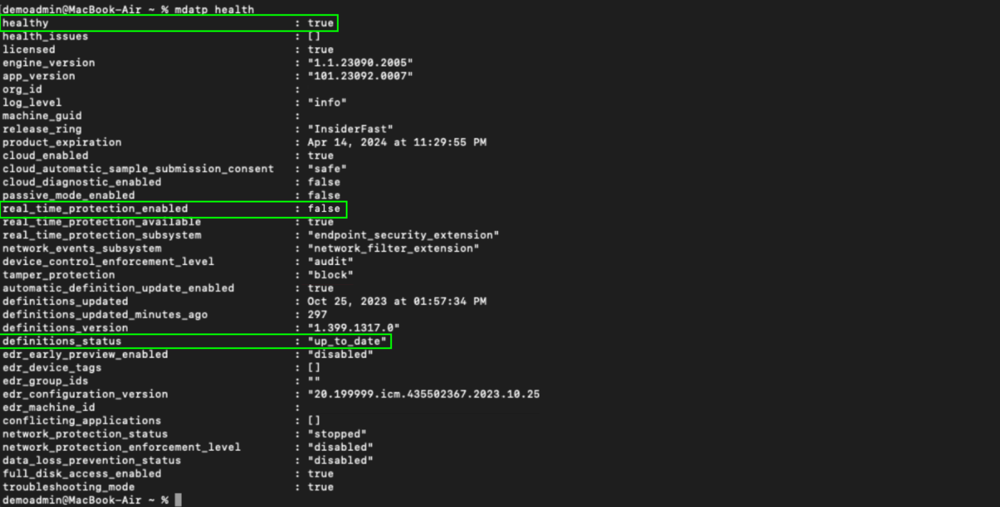
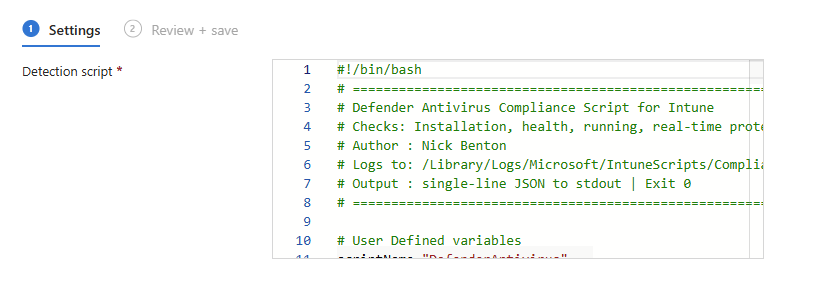
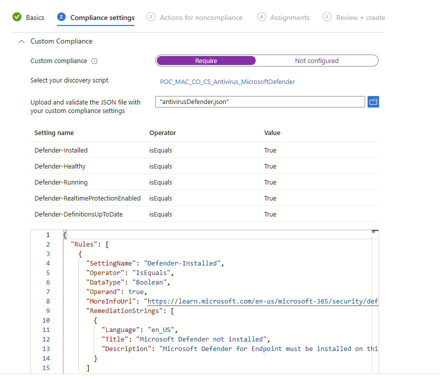
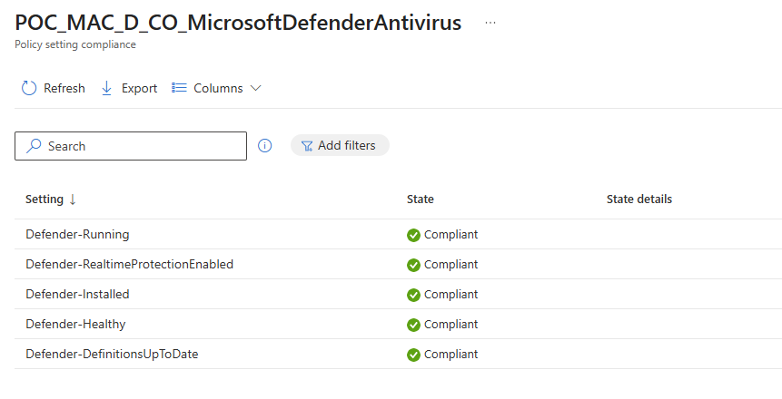

# Custom macOS Defender Antivirus Compliance


This feels like it's been a long time coming, but [Custom compliance](https://learn.microsoft.com/en-us/intune/device-security/compliance/custom-settings) has finally surfaced for macOS after being available for both Windows and Linux for some time in Microsoft Intune.

We're no stranger to antivirus based compliance policies, having used  before.

However this time, we can use these custom compliance scripts for Microsoft antivirus solutions (that's Defender if you hadn't realised), just on macOS devices instead.

## Custom Compliance

The principle for custom compliance on macOS is the same with the other operating systems, a discovery script and a validation check. If you take [Microsoft's word](https://learn.microsoft.com/en-us/intune/device-security/compliance/create-custom-script#sample-discovery-script-for-macos) all you need for macOS is the script to `echo` out a value and that's all there is to it:

```shell
# Fixed variables
attribute="CFBundleShortVersionString"
InfoPlistPath="/Library/Intune/Microsoft Intune Agent.app/Contents/Info.plist"

# Read the version string from the app's Info.plist and return it
if [[ -f "$InfoPlistPath" ]]; then
    ver=$(plutil -p "$InfoPlistPath" | grep "$attribute" | awk -F'"' '{ print $4 }')
    echo $ver
else
    echo "not installed"
fi
```

Well, this isn't the actual situation, you still need the script to return a **single-line JSON object** otherwise you're going to be in for a bad time 😅.

Other things to note about the script requirements:

- Obviously a valid shebang: `#!/bin/bash`
- Has to be UTF-8 encoded with no Byte Order Mark (BOM)
- The script should `Exit 0` for success
- No massive scripts above 1mb or that run longer than 10 minutes

With that cleared up, onto the script.


One other thing to note, is that I couldn't get the settings names to handle spaces, so in both the script and the JSON file these settings names either have to be one whole world, or separated by a `-` or `_`.


## Defender Health Status

As we care about the health status of Defender on our macOS fleet, we can use the [command line tool](https://learn.microsoft.com/en-us/defender-endpoint/mac-resources) `mdatp` and the corresponding command `mdatp health` to pull back so key information about the Defender installation.



Using this command we can capture status of the settings **healthy**, **definition_status** and **real_time_protection_enabled** which can be used in the script, among with other things, to work out whether Defender is working as expected.


Remember, we don't have to go hell for leather with these checks, the whole point of Compliance in Microsoft Intune is to work with a [Conditional Access Policy](https://learn.microsoft.com/en-us/entra/identity/conditional-access/policy-all-users-device-compliance), so we're only going to assess the device based on whether we feel it is "safe" to access Microsoft Entra ID authenticated services.


### Detection Script

I'm not going to bore you with how the content of the discovery script was created, but there are a few things to note:

- The script will generate a log located in `/Library/Logs/Microsoft/IntuneScripts/Compliance/DefenderAntivirus.log` for troubleshooting.
- The log file will rotate if it gets too large.
- It checks that Defender is actually installed and the antivirus daemon is running.
- It checks for the status of the three items captured from `mdatp health` (**healthy**, **definition_status** and **real_time_protection_enabled**).
- Each check will result in a `true` or `false`.
- It outputs the required JSON object and exits with a ~smile~ 0.

You can grab a copy of the script from my [GitHub repo](https://github.com/ennnbeee/oddsandendpoints-scripts/blob/main/Intune/Compliance/Custom/macOSDefender/antivirusDefender.sh).



### Validation

For the JSON validation file, other than making sure the output of the discovery script settings names match, the format is as per the Microsoft guidance (well almost 😂), and the **DataType** is set to `Boolean` (true or false), everything else is just niceties for the end user; basically what is shown to them if a setting is non-compliant in the Company Portal.



The JSON file is available in [GitHub](https://github.com/ennnbeee/oddsandendpoints-scripts/blob/main/Intune/Compliance/Custom/macOSDefender/antivirusDefender.json), feel free to update the values in the **RemediationStrings** with your own wording and links, but leave the **SettingName** alone, or else 😶.

## Microsoft Intune Compliance

With both required files now at your disposal, we can finally move away from the console and get back to the comfy GUI that is Microsoft Intune.

### Compliance Script

Navigate to **Devices > Compliance > Scripts** and select **Add** choosing **macOS** from the drop down, give the compliance script a useful name, and annoyingly, copy and paste the script into the **Detection Script** pane (honestly Microsoft this should be an upload 🤨)



### Compliance Policy

Wait a little bit, like go grab a coffee, then come back and we can create a new macOS compliance policy. Same deal as before, give the policy a useful name, select **Require** under Custom Compliance, then select **Click to select** and chose your uploaded script from the list.

Once you've done that you need to upload (see it's not that hard is it Microsoft) your JSON file so that the policy has something to validate the script against.



Go ahead and assign this to some test devices to make sure all is working, before fat fingering a deployment to all your macOS devices.

### Results

And after some (honestly it's pretty quick by normal Intune standards), you should start to see devices receive the policy and evaluate against it.




Remember, you can go have a look on the devices themselves at the log file `/Library/Logs/Microsoft/IntuneScripts/Compliance/DefenderAntivirus.log` to see if the script has actually run.


## Summary

Custom compliance still has it's troubles, with slow evaluation times and reporting (though it feels better on macOS than on Windows, go figure), but we're another step closer to macOS in Microsoft Intune being a supported enterprise level operating system, with management functionality edging toward that of Windows devices.

If you want a deeper dive into custom compliance on macOS, and who wouldn't, check out the post from [Somesh Pathak](https://intuneirl.com/custom-compliance-comes-to-macos-going-beyond-the-built-in-policy/) who goes to the lengths of evaluating CIS compliance using this new functionality, or the post from [SS Mac Admin](https://www.ssmacadmin.com/posts/2026-08-02-macos-custom-compliance-intune/) who provides multiple custom compliance examples.

