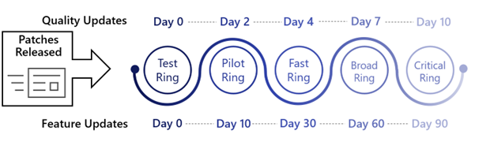
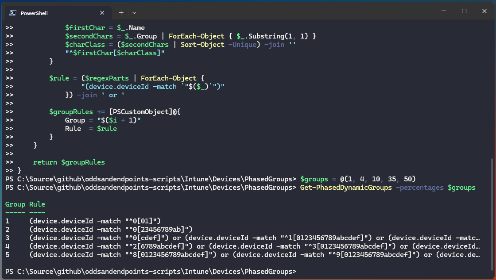
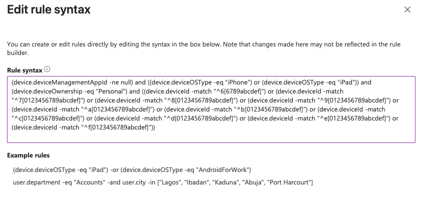

# Fine-Tuning Groups for Phased Deployments in Intune


You must either be living under a rock, or just using [Windows Autopatch](https://learn.microsoft.com/en-us/windows/deployment/windows-autopatch/overview/windows-autopatch-overview) to manage the delivery of Windows updates, if you aren't aware about using [Dynamic Security groups](https://learn.microsoft.com/en-us/entra/identity/users/groups-dynamic-membership) for phased update delivery.

You might not realise that you *could* and *should* be using these same groups for the deployment of controlled changes across your device estate, in a test, pilot, pre-production, production type approach whether this is for Windows, macOS, or mobile devices.



Now we're no stranger to using Dynamic Security groups in Entra to split our device estate in phased collections, having touched upon the subject [a](/posts/updates-self-service-deployment/), [few](/posts/macos-updates-phased-deployment/), [times](/posts/flexible-update-deployments/), [already](/posts/windows-update-phased-deployment/), but we may as well flog this horse for all it's worth and see if we can improve upon our existing logic.

## Broad Phasing

Previously we've used the `device.deviceId` attribute on computer objects in Entra, which is just a GUID/UUID, to group devices based on the start of this string whether its `0-9` or `a-f`.

As there are **sixteen** potential characters (I counted for you) this GUID can start with (a-f, 0-9), each one of these should in theory equal **6.25%** of all devices. You can then use this to create some bulky looking dynamic groups to split your device estate into chunks.


GUID (aka UUID) is an acronym for 'Globally Unique Identifier' (or 'Universally Unique Identifier'). It is a 128-bit integer number used to identify resources.


### Sample Groups

Using this calculation we can combine devices where their `device.deviceId` starts with differing characters to give us a set of groups that contain for example **6.25%**, **18.75%**, **31.25%**, and **43.75%** of all, in the below example, corporate owned, managed, Windows devices.

| Phase | Device Percentage | Rule |
| :-: | :-: | :- |
| 1 | 6.25% | `(device.deviceManagementAppId -ne null) and (device.deviceOwnership -eq "Company")  and (device.deviceOSType -eq "Windows") and (device.deviceId -startsWith "0")` |
| 2 | 18.75% | `(device.deviceManagementAppId -ne null) and (device.deviceOwnership -eq "Company")  and (device.deviceOSType -eq "Windows") and ((device.deviceId -startsWith "1") or (device.deviceId -startsWith "2") or (device.deviceId -startsWith "3"))` |
| 3 | 31.25% | `(device.deviceManagementAppId -ne null) and (device.deviceOwnership -eq "Company") and (device.deviceOSType -eq "Windows") and ((device.deviceId -startsWith "4") or (device.deviceId -startsWith "5") or (device.deviceId -startsWith "6") or (device.deviceId -startsWith "7") or (device.deviceId -startsWith "8"))` |
| 4 | 43.75% | `(device.deviceManagementAppId -ne null) and (device.deviceOwnership -eq "Company") and (device.deviceOSType -eq "Windows") and ((device.deviceId -startsWith "9") or (device.deviceId -startsWith "a") or (device.deviceId -startsWith "b") or (device.deviceId -startsWith "c") or (device.deviceId -startsWith "d") or (device.deviceId -startsWith "e") or (device.deviceId -startsWith "f"))` |


A device will only exist in **one** of these dynamic groups if you get your rules correct, with no overlapping starting characters.


Now these multiples of **6.25** phase groups *might* work for you, and you *might* want to use the smallest percentage as a pilot or test group...but ~6% of 10000 is 600 devices ([quick maths](https://www.youtube.com/watch?v=X09oxyIeGuY)) which isn't that small a test or pilot.

Can we use a similar approach using Entra groups to create fine-tuned deployment groups?

## Accurate Phased Groups

How about instead of the above 16 available characters to query in the start of the `device.deviceId` attribute, we extend that to the next character i.e., `device.deviceId -startsWith "01"` `device.deviceId -startsWith "02"`, `device.deviceId -startsWith "03"` etc., which would give us a massive **256** options -- each one corresponding to about **0.4%** of devices.

So now instead of grouping devices in blocks of 6% we can group them in roughly 0.4% chunks. Yeah I think that might be granular enough 😅.


I *think* this is how Microsoft is splitting devices in [Autopatch Dynamic Groups](https://learn.microsoft.com/en-us/windows/deployment/windows-autopatch/deploy/windows-autopatch-groups-overview) behind the scenes and perhaps a reason they've ~told us off for~ warned us about using [inefficient rules](https://learn.microsoft.com/en-us/entra/identity/users/groups-dynamic-rule-more-efficient) to save all the compute resources for themselves, but I'll take my tinfoil hat off for now 😂.


### Calculating Group Membership

Now the concept is all well and good, and I'm *OK* enough with PowerShell to give it a go myself, but there are times when coffee and caffeine don't cut it to get you the results you need, so we can lean on the new C-word in our lives ~nope~ Copilot.

So with a half decent prompt and some tweaks along the way:


*Using powershell, i want to be able to split out dynamic entra device groups based on the device attribute device.deviceId which is a UUID, based on percentages. So if I want approx 5% of all devices for the first group, it would equate to devices where device.deviceId starts with 00, 01, 02, 03, 04, 05, 06, 07, 08, 09, 0a, 0b, 0c. Then each subsequent group is 15%, 25%, 45% of devices. Give me the logic and the powershell script to able to use dynamic group membership percentages, ensuring for n groups the total adds to 100, and to make sure that no device is missed from any of the dynamic groups, so all device.deviceId are covered by only one dynamic group query.*


This gave me something to start with, but the results of the rules were way too long, and didn't allow me to actually save a group in Entra without it throwing a wobbly.


*Can you instead of using the startsWith operator can you use regex and the match operator?*


This just changed the logic and didn't shorten the rule length, as the rule just used the regex equivalent of startsWith.


*Great, but the benefit of using the match operator is to reduce the number of queries, so using regex can you update the function to combine values using regex and the match operator.*


### Testing the Function

Not sure Copilot like my sassy opener 🤐, but we got there in the end...a PowerShell function that will accept an array of values and kick out some basic Group rules.

```PowerShell
function Get-PhasedDynamicGroups {
    param (
        [int[]]$percentages
    )

    # Validate total percentage
    $total = ($percentages | Measure-Object -Sum).Sum
    if ($total -ne 100) {
        throw "Total percentage must equal 100. Current total: $total"
    }

    $hexValues = 0..255
    $groupSizes = $percentages | ForEach-Object { [math]::Round($_ * 256 / 100) }

    # Adjust rounding to ensure total is exactly 256
    $diff = 256 - ($groupSizes | Measure-Object -Sum).Sum
    if ($diff -ne 0) {
        $groupSizes[0] += $diff
    }

    $startIndex = 0
    $groupRules = @()

    for ($i = 0; $i -lt $groupSizes.Count; $i++) {
        $size = $groupSizes[$i]
        $prefixes = $hexValues[$startIndex..($startIndex + $size - 1)] | ForEach-Object {
            $_.ToString('x2')
        }
        $startIndex += $size

        # Group prefixes by first hex digit
        $grouped = $prefixes | Group-Object { $_.Substring(0, 1) }

        $regexParts = $grouped | ForEach-Object {
            $firstChar = $_.Name
            $secondChars = $_.Group | ForEach-Object { $_.Substring(1, 1) }
            $charClass = ($secondChars | Sort-Object -Unique) -join ''
            "^$firstChar[$charClass]"
        }

        $rule = ($regexParts | ForEach-Object {
                "(device.deviceId -match `"$($_)`")"
            }) -join ' or '

        $groupRules += [PSCustomObject]@{
            Group = "$($i + 1)"
            Rule  = $rule
        }
    }

    return $groupRules
}
```

You can try it yourself, throw an array of numbers that adds up to 100 at it and see what it kicks out.

```PowerShell
$groups = @(1, 4, 10, 35, 50)
Get-PhasedDynamicGroups -percentages $groups
```

Using the function and the above example in a PowerShell console:



Great that's half the battle, a list of rules for each of the five groups. But can we make it a little more user friendly?

## Expanding the Script

Back to using my actual brain 🧠 and not Copilot 🧙‍♂️, we can take the function and lob it into a more complete [script](https://github.com/ennnbeee/oddsandendpoints-scripts/blob/main/Intune/Devices/PhasedGroups/Get-PhasedGroupRules.ps1) giving us some parameters and a way to be specific in our group use.

With the following as options when running the script to create Operating System and/or Ownership specific rules:

- **operatingSystem**: Options from `Windows`, `macOS`, `Android`, `iOS`, and `All`
- **ownership**: Options from `Corporate`, `Personal`, and `Both`
- **groups**: How many group rules you want to create from `2` to `10`

We can go ahead and run the script to create some rules.

### Example 1 - Five Groups of Corporate Windows Devices

```PowerShell
./Get-PhasedGroupRules.ps1 -operatingSystem Windows -ownership Corporate -groups 5
```

Seeing it in action.



With generated group rules.

| Phase | Percentage | Rule |
| :-: | :-: | :- |
| 1 | 1% | `(device.deviceManagementAppId -ne null) and (device.deviceOSType -eq "Windows") and (device.deviceOwnership -eq "Company") and ((device.deviceId -match "^0[012]"))` |
| 2 | 4% | `(device.deviceManagementAppId -ne null) and (device.deviceOSType -eq "Windows") and (device.deviceOwnership -eq "Company") and ((device.deviceId -match "^0[3456789abc]"))` |
| 3 | 15% | `(device.deviceManagementAppId -ne null) and (device.deviceOSType -eq "Windows") and (device.deviceOwnership -eq "Company") and ((device.deviceId -match "^0[def]") or (device.deviceId-match "^1[0123456789abcdef]") or (device.deviceId -match "^2[0123456789abcdef]") or (device.deviceId -match "^3[012]"))` |
| 4 | 30% | `(device.deviceManagementAppId -ne null) and (device.deviceOSType -eq "Windows") and (device.deviceOwnership -eq "Company") and ((device.deviceId -match "^3[3456789abcdef]") or (device.deviceId -match "^4[0123456789abcdef]") or (device.deviceId -match "^5[0123456789abcdef]") or (device.deviceId -match "^6[0123456789abcdef]") or (device.deviceId -match "^7[0123456789abcdef]"))` |
| 5 | 50% | `(device.deviceManagementAppId -ne null) and (device.deviceOSType -eq "Windows") and (device.deviceOwnership -eq "Company") and ((device.deviceId -match "^8[0123456789abcdef]") or (device.deviceId -match "^9[0123456789abcdef]") or (device.deviceId -match "^a[0123456789abcdef]") or (device.deviceId -match "^b[0123456789abcdef]") or (device.deviceId -match "^c[0123456789abcdef]") or (device.deviceId -match "^d[0123456789abcdef]") or (device.deviceId -match "^e[0123456789abcdef]") or (device.deviceId -match "^f[0123456789abcdef]"))` |

### Example 2 - Four Groups of All macOS Devices

```PowerShell
./Get-PhasedGroupRules.ps1 -operatingSystem macOS -ownership Both -groups 4
```

More demos.



Different group rules.

| Phase | Percentage | Rule |
| :-: | :-: | :- |
| 1 | 5% | `(device.deviceManagementAppId -ne null) and (device.deviceOSType -eq "macmdm") and ((device.deviceId -match "^0[0123456789abc]"))` |
| 2 | 15% | `(device.deviceManagementAppId -ne null) and (device.deviceOSType -eq "macmdm") and ((device.deviceId -match "^0[def]") or (device.deviceId -match "^1[0123456789abcdef]") or (device.deviceId -match "^2[0123456789abcdef]") or (device.deviceId -match "^3[012]"))` |
| 3 | 30% | `(device.deviceManagementAppId -ne null) and (device.deviceOSType -eq "macmdm") and ((device.deviceId -match "^3[3456789abcdef]") or (device.deviceId -match "^4[0123456789abcdef]") or (device.deviceId -match "^5[0123456789abcdef]") or (device.deviceId -match "^6[0123456789abcdef]") or (device.deviceId -match "^7[0123456789abcdef]"))` |
| 4 | 50% | `(device.deviceManagementAppId -ne null) and (device.deviceOSType -eq "macmdm") and ((device.deviceId -match "^8[0123456789abcdef]") or (device.deviceId -match "^9[0123456789abcdef]") or (device.deviceId -match "^a[0123456789abcdef]") or (device.deviceId -match "^b[0123456789abcdef]") or (device.deviceId -match "^c[0123456789abcdef]") or (device.deviceId -match "^d[0123456789abcdef]") or (device.deviceId -match "^e[0123456789abcdef]") or (device.deviceId -match "^f[0123456789abcdef]"))` |

### Example 3 - Three Groups of Personal iOS/iPadOS Devices

```PowerShell
./Get-PhasedGroupRules.ps1 -operatingSystem iOS -ownership Personal -groups 3
```

Once more with feeling.



More group rules.

| Phase | Percentage | Rule |
| :-: | :-: | :- |
| 1 | 10% | `(device.deviceManagementAppId -ne null) and ((device.deviceOSType -eq "iPhone") or (device.deviceOSType -eq "iPad")) and (device.deviceOwnership -eq "Personal") and ((device.deviceId -match "^0[0123456789abcdef]") or (device.deviceId -match "^1[012345678]"))`|
| 2 | 30% | `(device.deviceManagementAppId -ne null) and ((device.deviceOSType -eq "iPhone") or (device.deviceOSType -eq "iPad")) and (device.deviceOwnership -eq "Personal") and ((device.deviceId -match "^1[9abcdef]") or (device.deviceId -match "^2[0123456789abcdef]") or (device.deviceId -match "^3[0123456789abcdef]") or (device.deviceId -match "^4[0123456789abcdef]") or (device.deviceId -match "^5[0123456789abcdef]") or (device.deviceId -match "^6[012345]"))`|
| 3 | 60% | `(device.deviceManagementAppId -ne null) and ((device.deviceOSType -eq "iPhone") or (device.deviceOSType -eq "iPad")) and (device.deviceOwnership -eq "Personal") and ((device.deviceId -match "^6[6789abcdef]") or (device.deviceId -match "^7[0123456789abcdef]") or (device.deviceId -match "^8[0123456789abcdef]") or (device.deviceId -match "^9[0123456789abcdef]") or (device.deviceId -match "^a[0123456789abcdef]") or (device.deviceId -match "^b[0123456789abcdef]") or (device.deviceId -match "^c[0123456789abcdef]") or (device.deviceId -match "^d[0123456789abcdef]") or (device.deviceId -match "^e[0123456789abcdef]") or (device.deviceId -match "^f[0123456789abcdef]"))` |

These rules can be used to create your granular phased dynamic device deployment groups in Entra to be used for Windows updates, macOS updates, new application deployments etc.



## Summary

You really should be making the most of the tools you have available for managing devices in Intune, and leveraging Dynamic Groups in this way to ensure controlled deployments of updates or new policies or applications, using these *very* granular dynamic groups is a great place to start.

If you want to see examples of where these phased groups can be used [Peter Klapwijk](https://nl.linkedin.com/in/dpklapwijk) has a [post](https://inthecloud247.com/deploy-microsoft-defender-updates-in-deployment-rings/) detailing exactly how they've been using them.

