# Block Windows Home Intune Enrolment


I'm not saying BYOD on Windows is a bad idea, far from it, with the correct policies in place in Intune and Entra ID, and even Defender for Cloud Apps if you want, you can somewhat manage these personally owned devices, whether you should or not is a different question.

But Windows Home *is* a different ~kettle of fish~ ~ball game~ story, there is limited management capability in Intune to support this consumer SKU, and with things like Windows Recall being available on Windows 11 Home, do you really want them all up in your ~grill~ data on what could be unprotected devices?

## Device Platform Restrictions

Blocking **all** personal Windows devices is pretty easy, just go update the Default [Enrolment Platform Restrictions](https://learn.microsoft.com/en-us/intune/intune-service/enrollment/enrollment-restrictions-set) in Intune, flipping the Personally owned slider to **Block**, and that's it no more Windows BYOD.

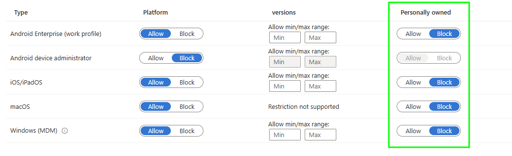

In fact, you should probably do this now. We'll create a new policy to allow Windows BYOD, but only for the devices we want to enrol to Intune.

### Allow Personally Owned Devices

Now that all Windows BYOD devices are blocked at the lower priority default Device Platform Restriction, we can create a new policy to allow Windows BYOD, for whatever group of users you wish.

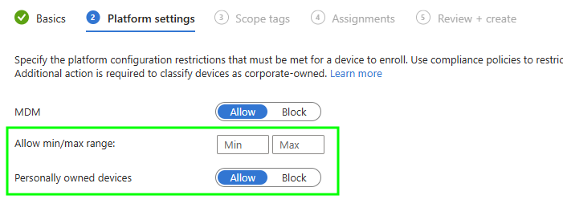

What's that under our assignment options? 🤔

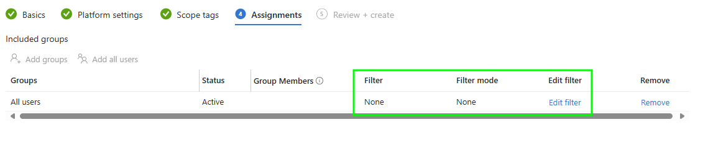

It's something that appeared relatively recently in the Device Platform Restriction assignment options, the ability to use an [Assignment Filter](https://learn.microsoft.com/en-us/intune/intune-service/enrollment/create-device-platform-restrictions#apply-assignment-filters).


You should probably at least set a minimum operating system version, to only allow supported Windows 11 Pro personally owned devices to enrol, which at time of writing will be **10.0.26100**. A maximum version is useful to stop Windows Insider builds from enrolling 🙃.


## Assignment Filters

The Assignment Filters are available for all operating systems when assigning Device Platform Restrictions, all except for Android 😂. Though these filters have a [limited set](https://learn.microsoft.com/en-us/intune/intune-service/enrollment/create-device-platform-restrictions#supported-filter-properties) of properties, only those that are available at time of device enrolment, for Windows it's the below.

- Manufacturer (OS Builds 22621.3374 and 22631.3374)
- Model (OS Builds 22621.3374 and 22631.3374)
- OS version
- **Operating system SKU**
- Ownership
- Enrolment profile name

We can use one of these options (the one in **bold**) and a little bit of logic, to ensure that only the Windows BYOD devices we want to enrol, can enrol in Intune.


The reason Assignment Filters and the use of built-in group 'All users' isn't available for Android, is it's dealing with two enrolment types (for now), Android Device Administrator and Android Enterprise, and behind the scenes it's actually two separate Graph API calls to set the restrictions.


### Windows Home Devices

If we're looking at blocking Windows Home editions, we need a way to exclude them from the assignment of the new Device Platform Restriction policy that allows BYOD. Sadly, there is no way to use the Assignment Filter in Exclude mode...

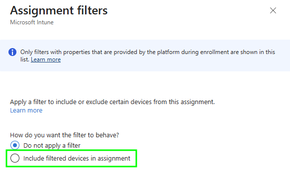

...only an include mode, so we're going to have to be a little creative with our Assignment Filter.

Using the `notIn` or `notContains` operators, we can create a new Windows [Assignment Filter](https://learn.microsoft.com/en-us/intune/intune-service/enrollment/create-device-platform-restrictions#apply-assignment-filters) with one of the below rules, which will basically exclude all Home editions of Windows.

```SQL
(device.operatingSystemSKU -notIn ["Core", "CoreCountrySpecific", "CoreN", "CoreSingleLanguage"])
```

Or for the ~lazy~ efficient...

```SQL
(device.operatingSystemSKU -notContains "Core")
```

This can then be used in the assignment of our BYOD Device Platform Restriction, to only allow the enrolment of personally owned Windows devices that are **not** Windows Home editions.

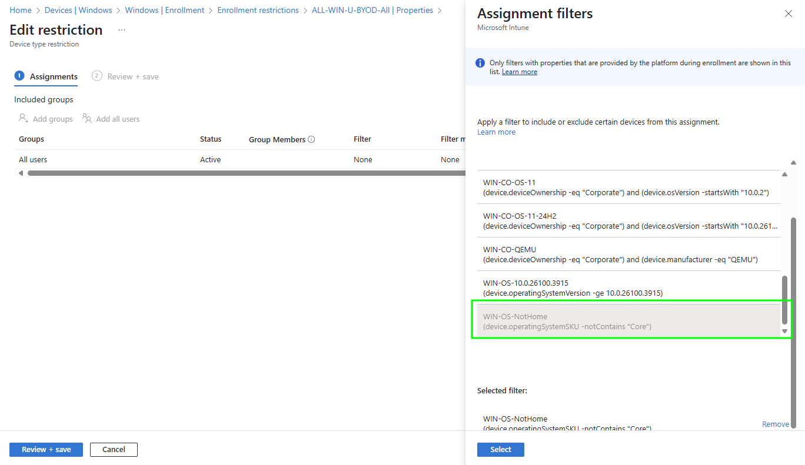

Time to see what happens with enrolment on personally owned Windows devices.

## Enrolment Experience

There are a few ways for end users to trip and fall into enrolling their unmanaged device into Intune, we'll look at the obvious ways to understand what the users will see on Windows Home devices when they are blocked from enrolment.

### Access Work or School

Where the most common accidental enrolment occurs, is when users attempt to add a Work or School account using the settings app. This will prompt them, annoyingly, whether they want their device to be managed, which they might want, but they won't get.

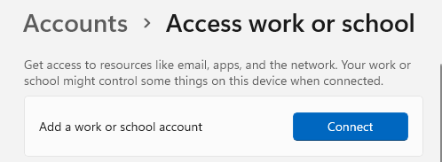

After selecting the **Connect** button and successfully signing in, they're presented with some type of loading page...

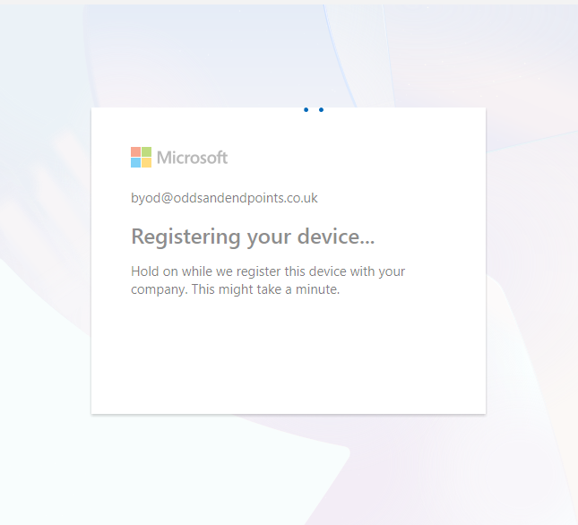

Followed by an error that doesn't necessarily make sense, but at least gives us the desired experience, and leaves the user with a ~boomer-esque~ confused look on their face 🧐.

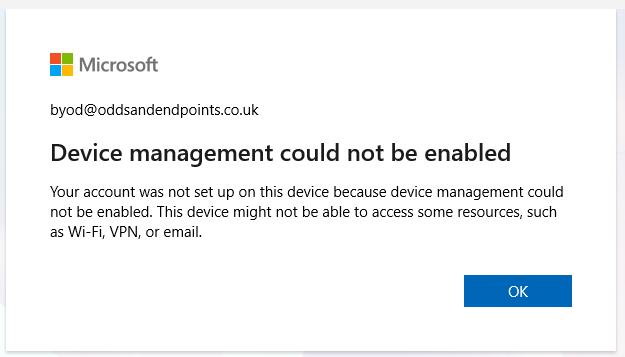

### Company Portal

I'm never sure why people go out of their way to install the Company Portal, but here we are, and in the event someone does and selects the below option, they should be blocked now we've implemented the new controls in Intune.

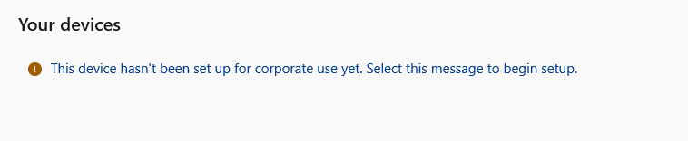

So if they do manage to stumble through the long winded enrolment process...

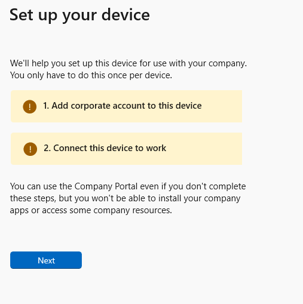

Which requires way too many clicks and options...

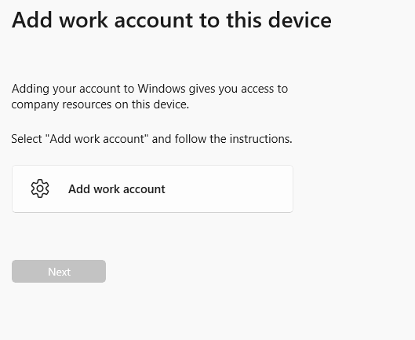

But at least the experience is starting to be consistent...


Giving the user the same ~two fingers~ error message when attempting to enrol.



Users will also get a similar error message if they are taken down the enrolment route by a [Conditional Access Policy](https://learn.microsoft.com/en-us/entra/identity/conditional-access/policy-all-users-device-compliance) that requires device compliance.


### Monitoring

Making sure all of this wasn't just a fluke, we can check in Intune under **Devices > Monitor > Enrol~l~ment failures** to confirm that the Windows Home device was blocked.

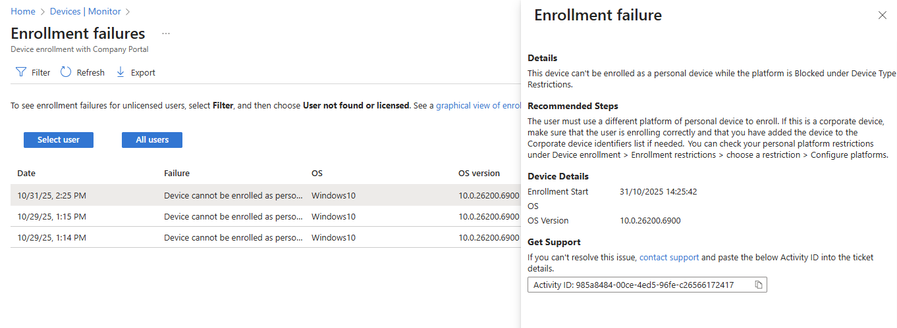

All that's left to do now is educate your Service Desk, and slightly more challenging, your users, about these new enrolment restrictions.

## Summary

For whatever reason you've got to block Windows Home editions, or any other edition of Windows for that matter, using the correct application of Device Platform Restrictions combined with Assignment Filters will allow you limit the Windows devices available to get through the door, and combined with suitable Conditional Access Policies means you're on the way to some type of Zero Trust security approach.

