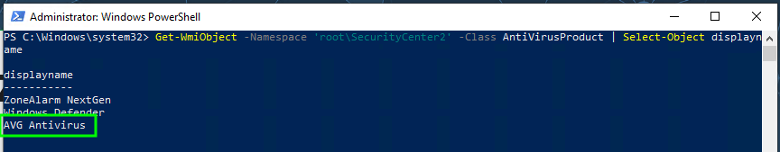
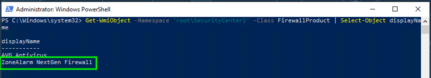
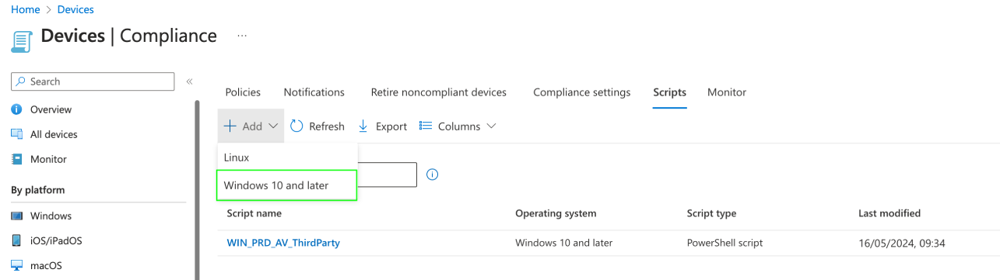
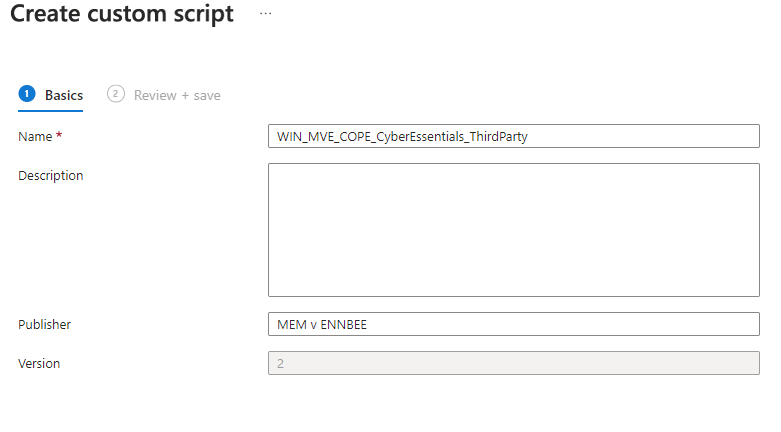
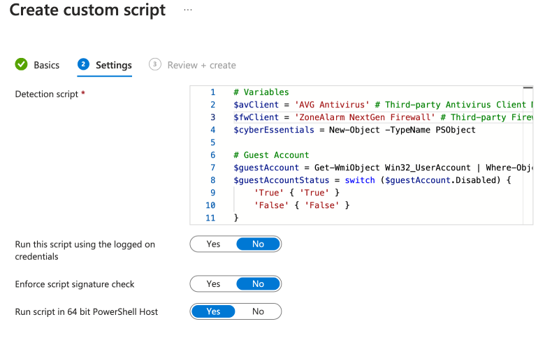
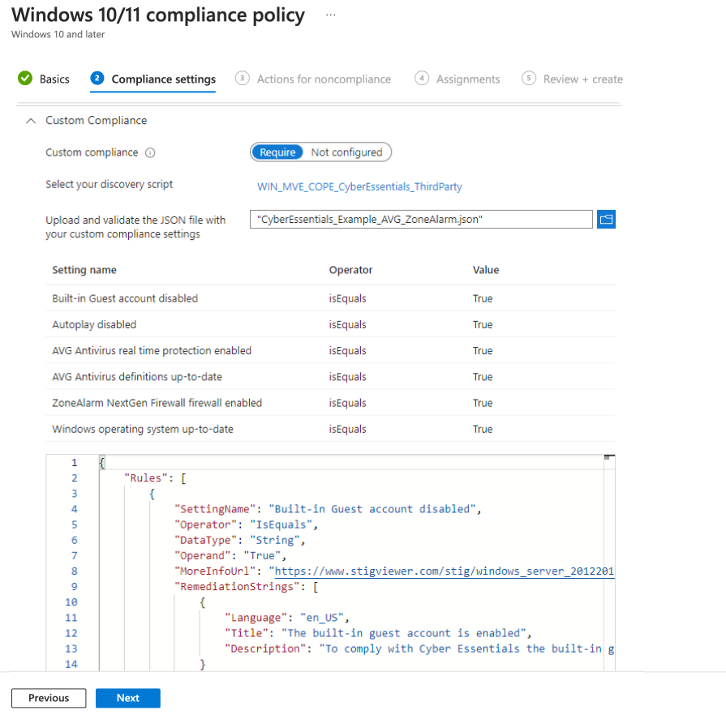
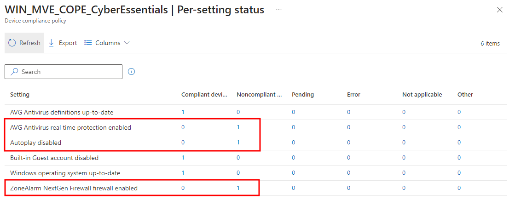
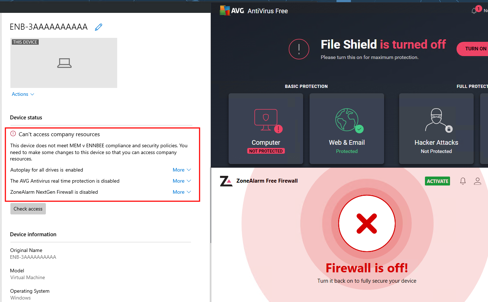
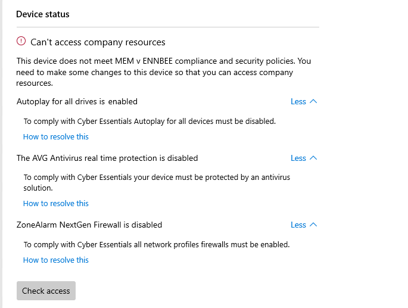

# Intune Custom Compliance for Cyber Essentials


Those outside of the UK may not have a scooby as to what [Cyber Essentials](https://www.ncsc.gov.uk/cyberessentials/overview) actually is, so in short, it's an assessed certification of a security standard provided by [The National Cyber Security Centre](https://www.ncsc.gov.uk/), for prevention of Cyber attacks by protecting your organisation and devices within.

Why do I care about Cyber Essentials? Well there's a good chunk of the [security framework focusing on end user devices](https://www.ncsc.gov.uk/files/cyber-essentials-requirements-for-it-infrastructure-v3-2.pdf), of which the majority of controls can be achieved natively using Microsoft Intune [Device Compliance](https://learn.microsoft.com/en-us/mem/intune/protect/device-compliance-get-started) policies.

Why am I writing this post if Microsoft Intune is already well positioned to secure devices to Cyber Essentials?

Well there are a few parts in the framework that Microsoft Intune doesn't just pop out and fix things for you.

## Cyber Essentials Requirements

To break down my understanding of Cyber Essentials for corporate owned devices, and the applicability to Device Compliance in Microsoft Intune, we need to ensure that a device is secured in the below broad ways:

- **Built-in Guest account disabled** - Remove and disable unnecessary user accounts (such as guest accounts and administrative accounts that won’t be used).
- **Autoplay disabled** - Disable any auto-run feature which allows file execution without user authorisation (such as when they are downloaded).
- **Device Antivirus enabled** - Prevent malware from running.
- **Device Antivirus definitions up-to-date** - Be updated in line with vendor recommendations.
- **Device Firewall enabled** - You must protect every device in scope with a correctly configured firewall (or network device with firewall functionality).
- **Operating system patched** - Be updated, including applying any manual configuration changes required to make the update effective, within 14 days of an update being released.

There are additional settings within the Cyber Essentials Requirements, that can be achieved using [Configuration Profiles](https://learn.microsoft.com/en-us/mem/intune/configuration/device-profile-create) in Microsoft Intune, but our focus is using Device Compliance and [Conditional Access](https://learn.microsoft.com/en-us/mem/intune/protect/conditional-access) to stop devices from accessing Entra authenticated services if they do not meet the above requirements.

## Compliance Policies

So you might be thinking, _"Well I'm using Windows Firewall, and Defender Antivirus, I'll just use the native compliance checks and I'll be on my way"_, well bully for you, not everyone has jumped to Microsoft for everything. As we've seen with  for antivirus previously, there is merit to getting additional information out of installed security products on Windows devices.

This in conjunction with the other Cyber Essentials requirements which don't have a nice interface to configure a Compliance Policy, means we have to lean into [Custom Compliance](https://learn.microsoft.com/en-us/mem/intune/protect/compliance-use-custom-settings) to retrieve the information we care about, and check it against our known good policy check.

It's worthwhile casting your eyes of the [pre-requisites](https://learn.microsoft.com/en-us/mem/intune/protect/compliance-use-custom-settings#prerequisites) for Custom Compliance, as they're not a one-size fits all setup, due to the need for an Entra Joined device, which is why we're only focussing on corporate owned devices as part of this post.

Pre-requisites aside, let's build ourselves a custom policy.

## Custom Compliance Discovery Script

The basis for any and all custom compliance policies on Windows devices, is a [discovery script](https://learn.microsoft.com/en-us/mem/intune/protect/compliance-custom-script) written in PowerShell to gather information, putting that information into the correct JSON format, and have Microsoft Intune check the data against a [validation JSON](https://learn.microsoft.com/en-us/mem/intune/protect/compliance-custom-json) file you create.

To support the first part, we need our PowerShell script to punt data into the required JSON format, to do this we create a new `PSObject` that we'll use to add to during the discovery script.

```PowerShell
$cyberEssentials = New-Object -TypeName PSObject
```

With the data receptacle (well that's a horrible choice of word) now ready, we can continue to create the rest of our discovery script for the Cyber Essentials requirements.

### Built-in Guest Account Discovery

We care only about the built-in Guest account, which _should_ be disabled across your devices, and with a Configuration Profile disabling it there should be no leaks, however, we're talking compliance here, so let's use the fact the that built-in Guest account has an [SID](https://learn.microsoft.com/en-us/windows-server/identity/ad-ds/manage/understand-security-identifiers) ending in `501`, and use the `Win32_UserAccount` WMI object to pull back all user accounts that are like this value, and check whether they are enabled or disabled.

```PowerShell
$guestAccount = Get-WmiObject Win32_UserAccount | Where-Object SID -Like '*501' | Select-Object Domain, Name, Disabled
[string]$guestAccountStatus = $guestAccount.Disabled

$cyberEssentials | Add-Member -MemberType NoteProperty -Name 'Guest account disabled' -Value $guestAccountStatus
```

All being well, our `$cyberEssentials` variable should now look like:

```PowerShell {hl_lines=[1]}
Guest account disabled : True
```

### Autoplay Discovery

To check if Autoplay is disabled for all drives, we can use the information in [STIG Viewer](https://www.stigviewer.com/stig/windows_10/2017-12-01/finding/V-63673) to work out what registy key and value is used to turn off Autoplay.

The `DWORD` value we're after in key `HKLM:\SOFTWARE\Microsoft\Windows\CurrentVersion\Policies\Explorer\` is `NoDriveTypeAutoRun` with a value off `255`, so with a quick call to the registry, and this time a `Try\Catch` setup to cover off if the value doesn't exist entirely, we can pull back information around Autoplay.

```PowerShell
Try {
    $autorunState = Get-ItemPropertyValue -Path 'HKLM:\SOFTWARE\Microsoft\Windows\CurrentVersion\Policies\Explorer\' -Name 'NoDriveTypeAutoRun'
    if ($autorunState -eq 255) {
        $autorunStatus = 'True'
    }
    else {
        $autorunStatus = 'False'
    }
}
Catch {
    $autorunStatus = 'False'
}

$cyberEssentials | Add-Member -MemberType NoteProperty -Name 'Autorun disabled' -Value $autorunStatus
```

Checking our variable now, we have new information:

```txt {hl_lines=[2]}
Guest account disabled : True
Autoplay disabled      : False
```

I should probably speak with whoever manages my Windows device at this point 👀.

### Antivirus Discovery

We're no stranger to dealing with  antivirus compliance, so I've stolen from my own scripts, which makes a change, and updated it a little to just look at the realtime protection status, and the definition update status.

If you are using a third-party antivirus solution, you need to update the `$avClient` variable with the name of the client, which can be captured by running the below on a target machine:

```PowerShell
Get-WmiObject -Namespace 'root\SecurityCenter2' -Class AntiVirusProduct | Select-Object displayName
```

This will give us the `displayName` of all security products registered under the `AntiVirusProduct` class, and importantly what we need to update the `$avClient` variable in our discovery script.



```PowerShell {hl_lines=[1]}
$avClient = 'AVG Antivirus' # Third-party Antivirus Client Name
if ($avClient) {
    $avProduct = Get-WmiObject -Namespace 'root\SecurityCenter2' -Class AntiVirusProduct | Where-Object { $_.displayName -eq $avClient } | Select-Object -First 1
    if ($avProduct) {
        [string]$avProductState = [System.Convert]::ToString($avProduct.productState, 16).PadLeft(6, '0')
        $avRealTimeProtection = $avProductState.Substring(2, 2)
        $avDefinitions = $avProductState.Substring(4, 2)

        $avRealTimeProtectionStatus = switch ($avRealTimeProtection) {
            '00' { 'False' }
            '01' { 'Expired' }
            '10' { 'True' }
            '11' { 'Snoozed' }
            default { 'Unknown' }
        }

        $avDefinitionStatus = switch ($avDefinitions) {
            '00' { 'True' }
            '10' { 'False' }
            default { 'Unknown' }
        }

        $cyberEssentials | Add-Member -MemberType NoteProperty -Name "$avClient real time protection enabled" -Value $avRealTimeProtectionStatus
        $cyberEssentials | Add-Member -MemberType NoteProperty -Name "$avClient definitions up-to-date" -Value $avDefinitionStatus
    }
    else {
        $cyberEssentials | Add-Member -MemberType NoteProperty -Name "$avClient real time protection enabled" -Value "Error: $avClient not product found"
        $cyberEssentials | Add-Member -MemberType NoteProperty -Name "$avClient definitions up-to-date" -Value "Error: $avClient not product found"
    }

}
else {
    # Defender
    $defenderStatus = Get-MpComputerStatus

    $defenderAM = $defenderStatus.AMServiceEnabled
    $defenderAS = $defenderStatus.AntispywareEnabled
    $defenderAV = $defenderStatus.AntivirusEnabled
    if ($defenderStatus.AntivirusSignatureAge -le 1) {
        $defenderSig = 'True'
    }
    else {
        $defenderSig = 'False'
    }

    $cyberEssentials | Add-Member -MemberType NoteProperty -Name 'Defender antimalware service enabled' -Value $defenderAM
    $cyberEssentials | Add-Member -MemberType NoteProperty -Name 'Defender antispyware enabled' -Value $defenderAS
    $cyberEssentials | Add-Member -MemberType NoteProperty -Name 'Defender antivirus enabled' -Value $defenderAV
    $cyberEssentials | Add-Member -MemberType NoteProperty -Name 'Defender signatures up-to-date' -Value $defenderSig

}
```

Running this section of the discovery script now gives us a bit more information about AVG:

```txt {hl_lines=["3-4"]}
Guest account disabled                     : True
Autoplay disabled                          : False
AVG Antivirus real time protection enabled : True
AVG Antivirus definitions up-to-date       : True
```

If you don't specify the `$avClient` variable, then the script will go have a peak at the state of your Defender setup instead:

```txt {hl_lines=["3-6"]}
Guest account disabled               : True
Autoplay disabled                    : False
Defender antimalware service enabled : True
Defender antispyware enabled         : True
Defender antivirus enabled           : True
Defender signatures up-to-date       : True
```


I am aware that there is native configuration for Defender state in Microsoft Intune, but I want a one stop shop for all things Cyber Essentials in a single compliance policy.


### Firewall Discovery

So we can thank previous me for working out how to deal translate the data coming back from WMI for the `AntiVirusProduct` class, as it translates to the `FirewallProduct` class as well, which means we can use similar logic in our discovery script to understand whether the firewall is enabled or not.

Running the below will give us the information we need about our third-party firewall:

```PowerShell
Get-WmiObject -Namespace 'root\SecurityCenter2' -Class FirewallProduct | Select-Object displayName
```

Now we can update the `$fwClient` variable with the `displayName` reported by the query above, in our script.



If there is no `$fwClient` variable specified, the script will go and check each of the Windows firewall profiles and report back on their health.

```PowerShell {hl_lines=[1]}
$fwClient = 'ZoneAlarm NextGen Firewall' # Third-party Firewall Client Name
if ($fwClient) {
    $fwProduct = Get-WmiObject -Namespace root\securityCenter2 -Class FirewallProduct | Where-Object { $_.displayName -eq $fwClient } | Select-Object -First 1
    if ($fwProduct) {

        [string]$fwProductState = [System.Convert]::ToString($fwProduct.ProductState, 16).padleft(6, '0')
        $fwProtection = $fwProductState.substring(2, 2)

        $fwProtectionStatus = switch ($fwProtection) {
            '00' { 'False' }
            '10' { 'True' }
            default { 'Unknown' }
        }

        $cyberEssentials | Add-Member -MemberType NoteProperty -Name "$fwClient firewall enabled" -Value $fwProtectionStatus
    }
    else {
        $cyberEssentials | Add-Member -MemberType NoteProperty -Name "$fwClient firewall enabled" -Value "Error: $fwClient product not found"
    }
}
else {
    # Defender Firewall Status
    $fwProfiles = Get-NetFirewallProfile
    foreach ($fwProfile in $fwProfiles) {

        $fwStatus = $fwProfile.Enabled
        $cyberEssentials | Add-Member -MemberType NoteProperty -Name "Windows Defender $($fwProfile.name) firewall enabled" -Value $fwStatus

    }
}
```

For our third-party firewall client ZoneAlarm NextGen Firewall we now get something like the below:

```txt {hl_lines=["5"]}
Guest account disabled                      : True
Autoplay disabled                           : False
AVG Antivirus real time protection enabled  : True
AVG Antivirus definitions up-to-date        : True
ZoneAlarm NextGen Firewall firewall enabled : False
```

Or still just using good old Windows Firewall, we get an output like this:

```txt {hl_lines=["7-9"]}
Guest account disabled                    : True
Autoplay disabled                         : False
Defender antimalware service enabled      : True
Defender antispyware enabled              : True
Defender antivirus enabled                : True
Defender signatures up-to-date            : True
Windows Defender Domain firewall enabled  : True
Windows Defender Private firewall enabled : True
Windows Defender Public firewall enabled  : True
```

We're almost there, and we've gathered some useful information so far.

### Windows Updates Discovery

I've had to get creative with this one, as can't rely on outside sources to understand whether the current build version of the device is the latest one, and deal with multiple feature update versions. So we're looking at the `LastWriteTimeUtc` from a list of files that get updated each month by Windows Updates. As updates are now cumulative, we just need to check when the last update was applied to the device, not which update was applied.

With this we can see when these files were last written to, which corresponds to when the last update was installed, so we need to make sure that the last time these files were written to, minus the day that the discovery script runs, is in the tolerance of having the latest update installed.

```PowerShell
$updateTime = Get-Item @(
    "${env:windir}\System32\ntoskrnl.exe",
    "${env:windir}\System32\win32k.sys",
    "${env:windir}\System32\win32kbase.sys",
    "${env:windir}\System32\win32kfull.sys",
    "${env:windir}\System32\ntdll.dll",
    "${env:windir}\System32\USER32.dll",
    "${env:windir}\System32\KERNEL32.dll",
    "${env:windir}\System32\HAL.dll"
) | Measure-Object -Maximum LastWriteTimeUtc | Select-Object -ExpandProperty Maximum

$todayTime = Get-Date
If ((New-TimeSpan -Start $updateTime -End $todayTime).Days -le 31) {
    $updateAge = 'True'
}
else {
    $updateAge = 'False'
}
$cyberEssentials | Add-Member -MemberType NoteProperty -Name 'Windows operating system up-to-date' -Value $updateAge
```

Running `(New-TimeSpan -Start $updateTime -End $todayTime).Days` on our test device, we can see that the days between today and the last update of those files gives us `232 days` which makes sense, as it's a fresh out the box copy of Windows 10 22H2 with no updates installed.

Continuing with the script we now get the following added to the `$cyberEssentials` object:

```txt {hl_lines=["6"]}
Guest account disabled                      : True
Autoplay disabled                           : False
AVG Antivirus real time protection enabled  : True
AVG Antivirus definitions up-to-date        : True
ZoneAlarm NextGen Firewall firewall enabled : False
Windows operating system up-to-date         : False
```


We might not be able to cover off that the update was installed in the last 14-days as per Cyber Essentials, but we can at least show that the device has the latest updates installed.


With a final line in the script to output the `$cyberEssentials` in the required format:

```PowerShell
return $cyberEssentials | ConvertTo-Json -Compress
```

This gives us all the information we're after from our Cyber Essentials based compliance policy, now we need to build our corresponding JSON answer file, and deploy the policy using Microsoft Intune.

## JSON Validation

Now that we have our [discovery script](https://github.com/ennnbeee/oddsandendpoints-scripts/blob/main/Intune/Compliance/Custom/CyberEssentials/CyberEssentials.ps1) in hand, we need to create the [JSON validation file](https://learn.microsoft.com/en-us/mem/intune/protect/compliance-custom-json), for our two main scenarios:

- **AVG Antivirus and Zone Alarm Firewall**
- **Defender Antivirus and Windows Firewall**

You can of course ~~butcher~~ modify the examples below based on your own scenarios, just make sure that the output coming from the discovery script matches the order of the JSON file.


If you are using the examples, you will need to update the `SettingName` entries with your own third-party security software names, as the discovery script uses the `$avClient` and `$fwClient` variables to create the SettingName titles in the output of the discovery script.


### Third-Party JSON

Using both third-party antivirus and firewall solutions, our [JSON file](https://github.com/ennnbeee/oddsandendpoints-scripts/blob/main/Intune/Compliance/Custom/CyberEssentials/CyberEssentials_Example_AVG_ZoneAlarm.json) looks something like the below, being careful with case-sensitivity across the `SettingName` values:



In my old age I'm getting kinder and kinder to end users, providing useful descriptions and even links to how to resolve the non-compliance issues within these policies. Not that the end user will look at them tbh, but still, I've done my part to make the Company Portal information look good.

### Defender JSON

If you're all over Defender and Microsoft security solutions, and who wouldn't be, then the below [JSON](https://github.com/ennnbeee/oddsandendpoints-scripts/blob/main/Intune/Compliance/Custom/CyberEssentials/CyberEssentials_Example_Defender.json) is for you:



With a validation file saved, we can now move to the final step, and the whole point, creating Compliance Policies that align with Cyber Essentials.

## Deploying Custom Compliance

After a whole lot of PowerShell and JSON, we're now at the point where we can smush it all together to get our desired outcome, a Device Compliance Policy to check for Cyber Essentials requirements, and if we're using compliance based Conditional Access policy, a true way to say GTFO if you're not secure (your device, not your self esteem).

### Compliance Scripts

So off into the safe space that is Microsoft Intune to create a Cyber Essentials based Compliance Policy, but before that, we'd better add our discovery script otherwise we're not going to make any progress.

Navigate to **Devices > Compliance > Scripts** and select the happy looking **Add+** button, choosing **Windows 10 and later**:



Give the new script a name, (_check me out with a naming convention at last_):



Select **Next**, and the paste in the discovery script, (honestly, an upload would be much better here but whatever), here you can update the `$avClient` and `$fwClient` variables if you're using third-party solutions and haven't updated the script previously:




Make sure `Run script in 64 bit PowerShell Host` is set to **Yes**, leave everything else as is.


Once you've selected **Create** you might need to wait a few minutes for the new script to appear in the pane.

### Compliance Policy

Go create yourself a new **Windows 10 and later** compliance policy, and stick with whatever naming convention works for you, selecting **Next** after you've done so.

Expand **Custom Compliance** and select **Require** and select the discovery script that we uploaded in the previous step.

Once you've selected the discovery script we created previously, we now need to upload the JSON validation file, and in doing so, if all went well, Microsoft Intune will display the settings the custom compliance section will look for:



We're now in a position to configure the actions for non-compliance, and the assignments. After that, we just need to wait for our devices to check in, evaluate the policy and report back to Microsoft Intune their results.

### Compliance Results

After waiting for our device to evaluate the compliance policy, at some point, maybe 20 minutes, we should start to get data back into Microsoft Intune showing the sorry state the device is in:



Checking on our test device, with the Zone Alarm firewall and AVG antivirus protection disabled, we can see that the Company Portal is reporting the correct non-compliance status:



By expanding the non-compliance notifications, we can make sure that our configured JSON validation settings are displaying nice messages to our end users:



So there we have it, the compliance policy doing what it's good at.


This is the stage you now consider Conditional Access Policies to require [device compliance](https://learn.microsoft.com/en-us/mem/intune/protect/conditional-access) and stop rogue devices from connecting to Entra authenticated services.


## Summary

This Custom Compliance policy isn't going to be for everyone, but for those that are looking to align with Cyber Essentials and a zero trust approach based on these requirements, it's a must have use of Microsoft Intune.

Even if you're not jumping on the shiny new security badge bandwagon, there isn't anything stopping you taking these example compliance settings and building your own based upon them, to add to, or improve upon your existing compliance policies for corporate owned Windows devices.

Just remember that there are still some [limitations](https://learn.microsoft.com/en-us/mem/intune/protect/compliance-use-custom-settings#troubleshoot-custom-compliance-for-devices) with Custom Compliance policies that you need to be aware of before just punting them into Microsoft Intune blindly.

