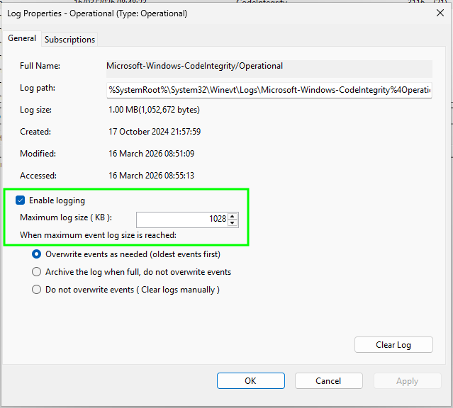
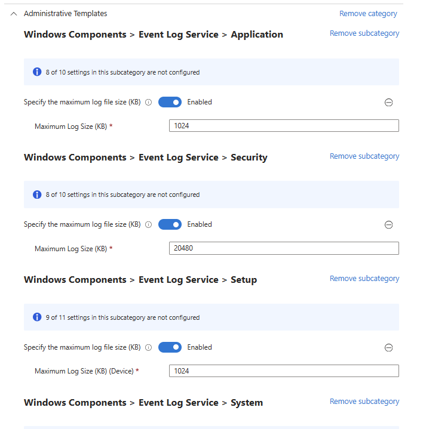
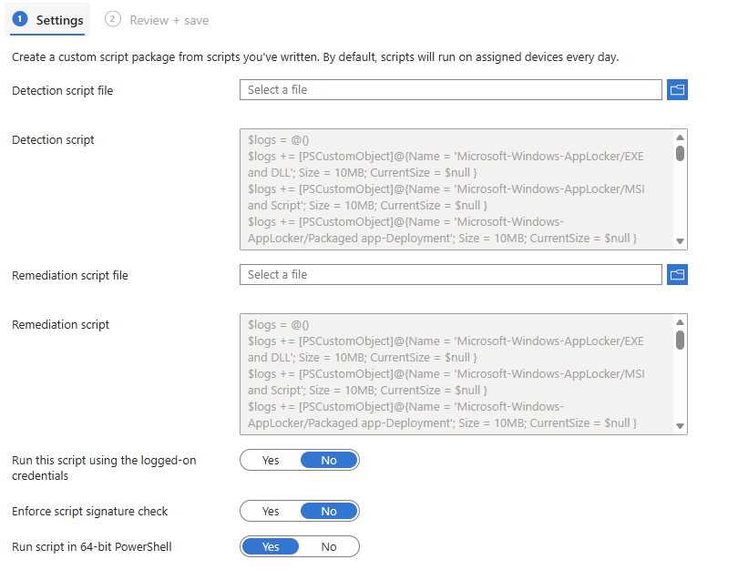
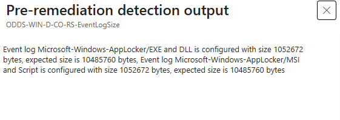
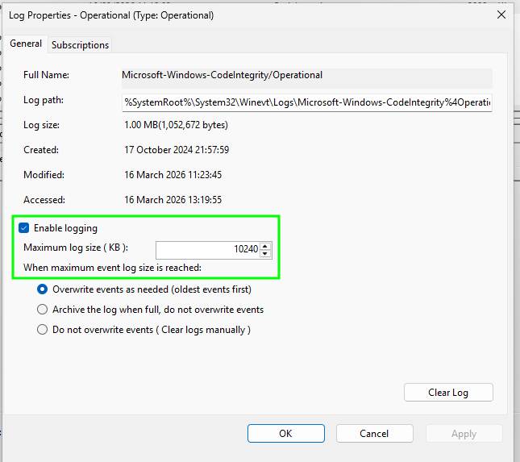

# Updating Event Log Sizes with Intune and PowerShell

If you've ever implemented [AppLocker](https://learn.microsoft.com/en-us/windows/security/application-security/application-control/app-control-for-business/applocker/applocker-overview) or its bigger [security heavy](https://www.tiktok.com/@wespeakenglishgood/video/7543509314602814734) sibling formerly known as Windows Defender App Control, [App Control for Business (ACFB)](https://learn.microsoft.com/en-us/windows/security/application-security/application-control/app-control-for-business/appcontrol-and-applocker-overview), you've likely been ~nope~ knees deep in either event logs on local machines, or trying your hand at advanced hunting in Defender for Endpoint.

What makes life difficult about trawling through local event logs, or parsing them using the [App Control Wizard](https://learn.microsoft.com/en-us/windows/security/application-security/application-control/app-control-for-business/design/appcontrol-wizard-parsing-event-logs#app-control-event-viewer-log-parsing) 🧙, is that they're a maximum of **1028KB**.

Meaning that your investigation is likely going to come up short when the logs start deleting themselves. But there must be a native way to change the maximum log size of these critical to both audit and implementation of ~WDAC~ ACFB [event logs](https://learn.microsoft.com/en-us/windows/security/application-security/application-control/app-control-for-business/operations/event-id-explanations#core-app-control-event-logs)?

## Event Logs

Well there isn't.

At least not for event logs that aren't your standard Application, Security, Setup, and System logs.

So what do we want to do tonight? The same thing we do every night, try to ~take over the world~ to fix things with PowerShell 🐭.

## PowerShell Logic

All we need is a way to detect the current size of our chosen event logs, and if they aren't good enough, to set them to a new size.

As always, Microsoft has done a pretty good job at [documenting the process](https://learn.microsoft.com/en-us/powershell/module/microsoft.powershell.diagnostics/get-winevent) using the `Get-WinEvent` command, so we'll lean on that to loop through the event logs we want to update.

For completions sake, we'll be updating the log size for *all* the AppLocker event logs, not just those used by App Control for Business, as well as the Code Integrity log. So either using your eyes and event viewer, or using PowerShell (`Get-WinEvent -ListLog *`) we can get a list of event logs and the names of the ones we want to ~tamper~ ~fiddle~ ~break~ mess with.

- Microsoft-Windows-AppLocker/EXE and DLL
- Microsoft-Windows-AppLocker/MSI and Script
- Microsoft-Windows-AppLocker/Packaged app-Deployment
- Microsoft-Windows-AppLocker/Packaged app-Execution
- Microsoft-Windows-CodeIntegrity/Operational

We can then throw these event log names with their desired sizes as a [PSCustomObject](https://learn.microsoft.com/en-us/powershell/scripting/learn/deep-dives/everything-about-pscustomobject) into an array, so that both the detection and remediation script can use this data to set the new event log size.


The maximum log size is **18014398509481983 Kilobytes** so don't take the piss and try and set the log size to be bigger **18014398 Terabytes**


Now with the basic setup done with, now all that's needed are the detection and remediation scripts.

### Detection Script

For each of your event logs (and remember this can be any event log), make sure you are using the correct name and a suitable size, for this example each log will be set to **10MB**.

We're also capturing which of the event logs don't match the required size in a `$remediateOutput` array variable, so we can output that in Intune in the event that the current log size doesn't match.



### Remediation Script

We don't need the remediation script to display anything pretty, it just needs to be functional, so when an event logs current size doesn't match the required size, it will update it.




Make sure that the event logs and their sizes you've set in the detection script match those in the remediation script otherwise you'll be in an endless loop of remediating device event logs.


## Proactive Remediations

With the above scripts in hand, wander over to Intune and deploy them to your devices with the settings below.

And after a little patience, or by forcing a remediation to run, your devices will start reporting their event log sizes, and updating them to the new ones if they need to.


I've had to join the `$remediateOutput` array variable to make it a string, otherwise Intune will only output the last entry in the array, and that's pretty useless 😅.


Checking on the device we can see that it has actually updated the log size if the event logs in question.

Which will hopefully make hunting through event logs a little more fruitful as part of your App Control for Business or even AppLocker implementation, audit, or testing.

## Summary

It really *shouldn't* be that difficult to increase the event log size, especially of actual Microsoft event logs, but until there's a nicer native way to do it, you're going to have to rely on good ol' PowerShell and ~friendly~ folks like myself to patch the gaps in Microsoft device management tooling 😇.

