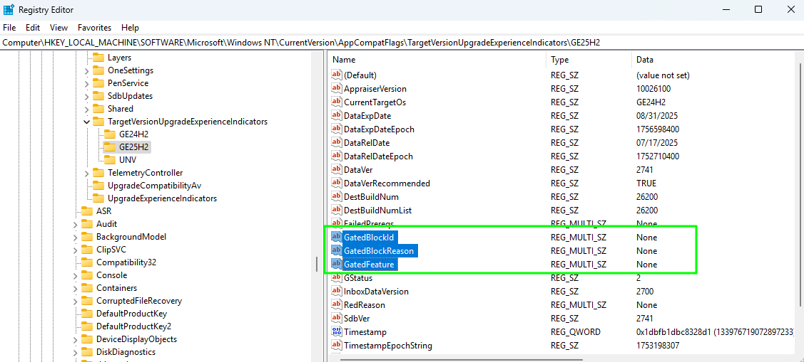
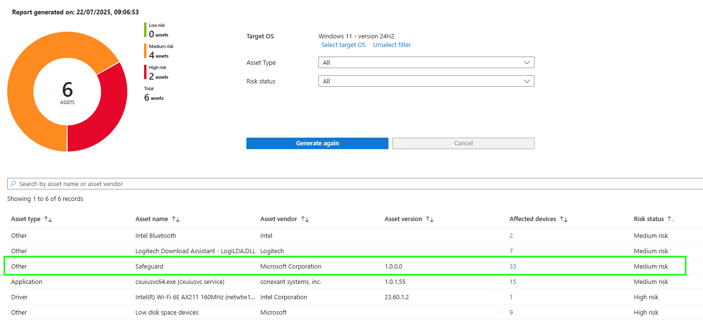
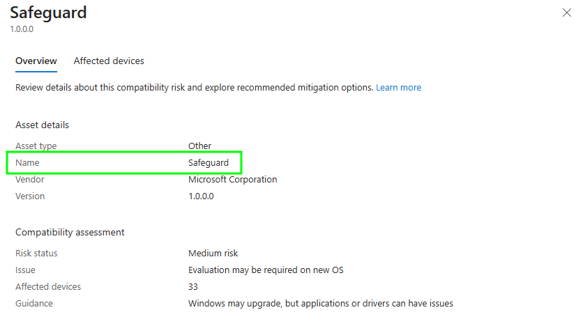
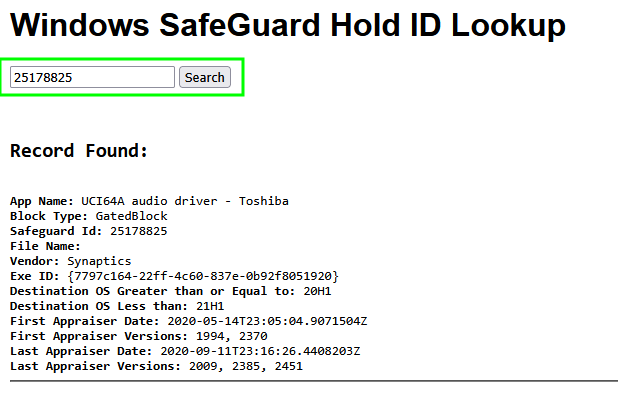
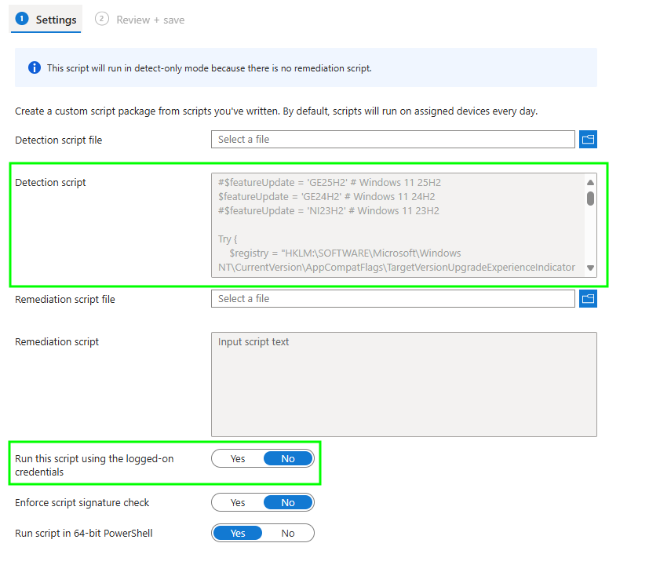
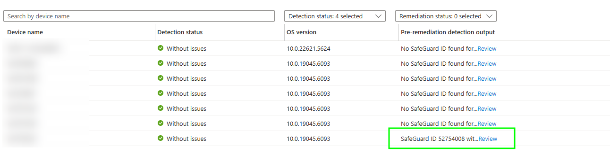
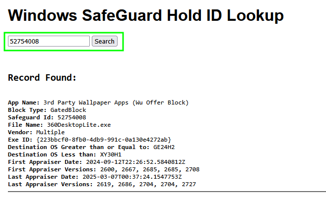

# Capturing Windows Feature Update Safeguard Holds

We're all on Windows 11 now aren't we? Deployed it using Intune [feature update policies](https://learn.microsoft.com/en-us/intune/intune-service/protect/windows-10-feature-updates) and everyone is happy?

What's that I hear, you've got devices that just won't update and are complaining about [Safeguard holds](https://learn.microsoft.com/en-us/windows/deployment/update/safeguard-holds)?

Do you really want to dig through each and every device to work out what is causing the hold?

I didn't think so.

## Safeguard Holds

There is plenty of information about what these are and why they are in place (just ~Google~ Bing it)

> *Microsoft uses quality and compatibility data to identify issues that might cause a Windows client feature update to fail or roll back. When we find such an issue, we might apply safeguard holds to the updating service to prevent affected devices from installing the update in order to safeguard them from these experiences. We also use safeguard holds when a customer, a partner, or Microsoft internal validation finds an issue that would cause severe effect (for example, rollback of the update, data loss, loss of connectivity, or loss of key functionality) and when a workaround isn't immediately available.*

But what is frustrating is that the details of the Safeguard hold on devices is in the exact same place as the Feature Update Readiness and App Compatibility data...the registry.

So it *could* be captured by Intune and processed by Microsoft to appear in some kind of report, in the same way they've dealt with the [App Compatibility reports](https://learn.microsoft.com/en-us/intune/intune-service/protect/windows-update-compatibility-reports).

The fact that these reports actually advise where devices are subject to Safeguard holds but not what they are is a bit of a piss take, come on Microsoft 👀.

### Safeguard ID Lookup

What we actually need from these devices is the Safeguard Id, and a way to look this up, luckily we can use a tool provided by [Gary Blok](https://www.linkedin.com/in/garyblok/) author of [garytown.com](https://garytown.com/) and their wonderful crowd sourced [Windows SafeGuard Hold ID Lookup tool](https://html-preview.github.io/?url=https://github.com/gwblok/garytown/blob/master/Feature-Updates/SafeGuardHolds/SafeGuardHoldLookup.html) to get the details from the provided Safeguard Id.

Now we just need a way to get these Ids from devices en masse (*that means "in bulk"* 🙃).

## Intune and Remediations

Yeah, pretty obvious solution here, use Intune and a [Remediation script](https://learn.microsoft.com/en-us/intune/intune-service/fundamentals/remediations) to pull back these Safeguard hold Ids so we can look them up.

Oddly though, we don't actually need to remediate (*that means "fix"*) anything, so we're only using a detection script, which feels a little ~cuckholdy~ half arsed.

### Detection Script

Either way, depending on the Feature Update you need information about, update the `$featureUpdate` variable with the corresponding version in the detection script below in a similar way as we did in the  post.

| Registry Key | Feature Update Version |
| :- | :- |
| `GE25H2` | Windows 11 25H2 |
| `GE24H2` | Windows 11 24H2 |
| `NI23H2` | Windows 11 23H2 |


You really shouldn't be pushing out Windows 11 23H2 at this point, and Windows 11 25H2 isn't available yet, but it doesn't hurt to be prepared.




Now just to yeet the script into Intune.

### Script Deployment

We don't need a remediation script, as we're just using the detection to pull back the Safeguard Id information we need, as per the notice.

> This script will run in detect-only mode because there is no remediation script.

Thanks Microsoft, [Thankrosoft](https://www.youtube.com/watch?v=9jtU9BbReQk).

You can deploy this to whatever set of devices you want, but I've used my own ~circle-jerk~ self-serving tooling [Win11Accelerator](https://github.com/ennnbeee/Win11Accelerator) that tags devices with their Windows Feature Update risk score, so I can group the [Medium and High Risk](https://learn.microsoft.com/en-us/intune/intune-service/protect/windows-update-compatibility-reports#use-the-windows-feature-update-device-readiness-report) devices that might actually have Safeguard holds.

Giving us some wonderful outputs from devices with Safeguard holds, and importantly the Id.

## Safeguard Hold Details

Now armed with some Ids from the remediation script, it's now time to look them up and work out how the hell we fix them without resorting to just ~cop out~ [opt out of the Safeguard hold](https://learn.microsoft.com/en-us/windows/deployment/update/safeguard-opt-out).

Checking the Id of `52754008` the script captured, we can see the below reason behind the hold.

So we've now got something to actually work with to work around the Safeguard hold, and let these devices update to Windows 11 24H2.

## Summary

Come on now there should be no excuse for sticking around on Windows 10, it's [not dead yet](https://www.youtube.com/watch?v=EfOW9QrLs0o) but it will be, so pull up your pants and start using as many methods as possible to update your devices.

Off you go now.

