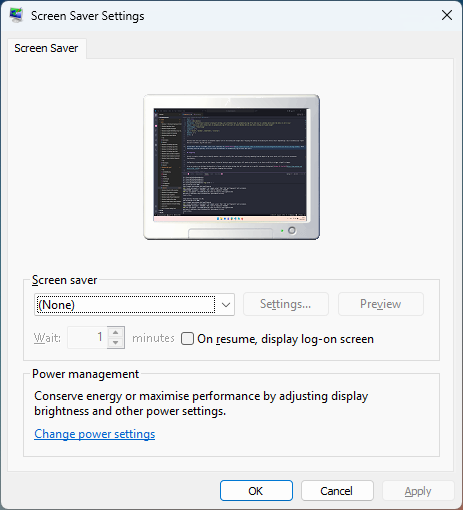
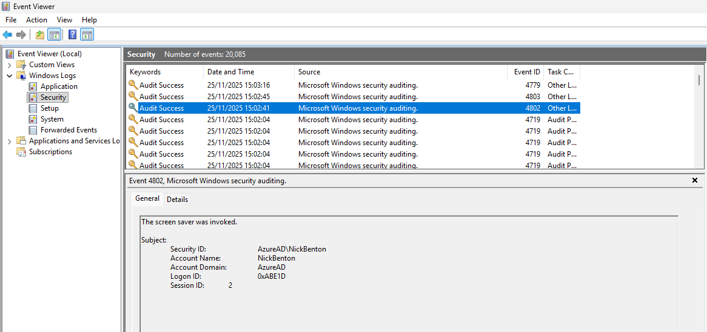
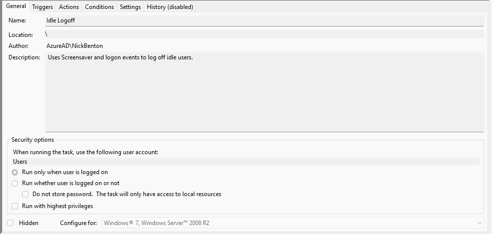
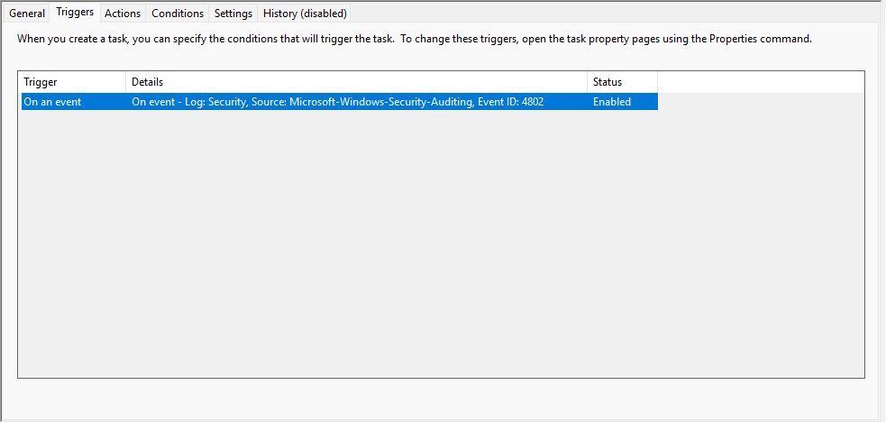
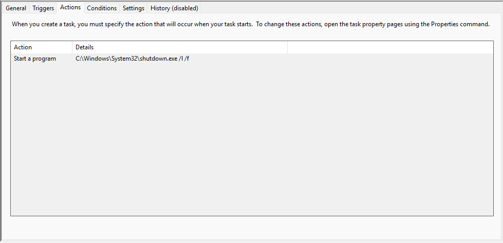

# Automatically Logging Off Idle Windows Devices

How many times have you walked by an abandoned computer left on the desktop and thought about ~flipping the desktop and disabling the shortcut keys~ implementing a way to automatically ~report the user to InfoSec~ log off idle users?

For me? Never. But for a customer, quite a lot, especially on [Shared Devices](https://learn.microsoft.com/en-us/intune/intune-service/configuration/shared-user-device-settings-windows), which inevitably posed the question, *"Can we use Intune and PowerShell to automatically log off these idle users?"*.

Sure, why not. New year ~new~ old me.

## Triggering

Firstly, we need a suitable and importantly built-in way to identify whether a device is actually idle, and instead of conjuring something from the depths of my ~arse~ brain, we'll just use the screensaver functionality.

### Screensaver Settings

Configuring a screensaver with an idle timeout, instead of having to apply our own logic, will speed up the process, or at least an ability to trigger a logoff to happen.

So we can create a new Settings Catalog policy in Intune, with the below settings that will enable and set a specific screensaver (bring back [Windows XP Starfield](https://www.youtube.com/watch?v=CRQF__6A93k)), the timeout, and stop users changing these settings which we will actually rely on for something other than power saving.

| Category | Setting | Value |
| :- | :- | :- |
| Administrative Templates > Control Panel > Personalization | Enable screen saver (User) | `Enabled` |
| Administrative Templates > Control Panel > Personalization | Force specific screen saver (User) | `Enabled` |
| Administrative Templates > Control Panel > Personalization | Force specific screen saver (User) > Screen saver executable name (User) | `%Systemroot%\System32\Ribbons.scr` |
| Administrative Templates > Control Panel > Personalization| Prevent changing screen saver (User) | `Enabled` |
| Administrative Templates > Control Panel > Personalization | Screen saver timeout (User) | `Enabled` |
| Administrative Templates > Control Panel > Personalization | Screen saver timeout (User) > Seconds: (User) | `30` |

For testing, I'm setting the **Screen saver timeout (User) > Seconds: (User)** to `30` so I'm not sitting around twiddling my thumbs waiting for something to happen, I'd suggest you set this to something more realistic before you deploy this policy.

With these settings applied you should see them in the [HKCU](https://learn.microsoft.com/en-us/troubleshoot/windows-server/performance/windows-registry-advanced-users) registry of the logged in user under `HKEY_CURRENT_USER\Software\Policies\Microsoft\Windows\Control Panel\Desktop`.


The screensaver will trigger even if the device is locked, but not if the device is asleep, so you may have to amend the timeout settings to suit your setup.


### Event Logs

With a policy configuring the screensaver to start after a set idle time, we now need a way to initiate a shutdown based on this event (*hint hint*).

Luckily for us, with the right audit policies, we can capture [Event ID 4802](https://learn.microsoft.com/en-us/previous-versions/windows/it-pro/windows-10/security/threat-protection/auditing/event-4802) which covers whether a screensaver was invoked (that's "started" to you and me).

Now for that event to even be displayed, we need to turn on auditing of [Other Logon/Logoff Events](https://learn.microsoft.com/en-us/previous-versions/windows/it-pro/windows-10/security/threat-protection/auditing/audit-other-logonlogoff-events), which can be done using Intune, so go and update your Settings Catalog policy with the below setting.

| Category | Setting | Value |
| :- | :- | :- |
| Auditing | Account Logon Audit Other Account Logon Events | `Success` |

Right, screensaver and an event to capture when a screensaver was run, now to work out how to log a user off.

### Scheduled Tasks

Yeah, I'm not a massive fan of this tbh, but here we are.

With a Scheduled Task, we can use the event log as a trigger condition, for something to happen, for us this will be kicking the user out of their session.

So a quick browse of the [Microsoft learn](https://learn.microsoft.com/en-us/powershell/module/scheduledtasks/new-scheduledtaskaction) pages about how to create a Scheduled Task using PowerShell, we can come up with the below [script](https://github.com/ennnbeee/oddsandendpoints-scripts/tree/main/Intune/PlatformScripts/PowerShell/AutoLogOff).



Which we can deploy to devices using Intune, and will carry out the following:

- Creates a Scheduled Task Action to force a logoff using **shutdown.exe /l /f**
- Sets the Scheduled Task to run as **BUILTIN\Users** so that any logged on user is effected by the task
- Creates a Scheduled Task Trigger to act upon **Event ID 4802** from the **Microsoft Windows security auditing** event log
- Creates the Scheduled Task on the targeted devices

Before you rush to Intune and deploy this, go and run this on a test device first, it doesn't even need the screensaver or event logs configured, you know, just make sure it creates a Scheduled Task first 🫠.

## Intune Deployment

With the confidence and trust in me that I can actually write PowerShell scripts (and I test them and deploy them 🫣), go and lob the [script](https://github.com/ennnbeee/oddsandendpoints-scripts/tree/main/Intune/PlatformScripts/PowerShell/AutoLogOff) into Intune and deploy to a test group of devices using [Platform scripts](https://learn.microsoft.com/en-us/intune/intune-service/apps/powershell-scripts).

Just make sure that you configure the deployment with the below settings.

| Setting | Value |
| :- | :- |
| Run this script using the logged on credentials | `No` |
| Enforce script signature check | `No` |
| Run script in 64 bit PowerShell Host | `Yes` |

With a bit of luck, and the usual patience, the script will run on the targeted devices and along with the corresponding Settings Catalog policy to configure the screensaver and event log audit settings, we should be good.

### Scheduled Task Settings

To make sure that the script has done what we've asked it to, you should now see a new Scheduled Task deployed to your targeted devices.

With the correct trigger configured based on **Event ID 4802** from the **Microsoft Windows security auditing** event log.

And the action to force logoff the user on the device using the **shutdown.exe** application.

All we need now are some idle users 😅.

### Scheduled Task in Action

For those that didn't get enough time off over the Christmas/Winter holidays to watch videos, here's one showing the logoff process.



Here the device has been idle for the configured 30 seconds (just assume this is true, also please update the screensaver timeout setting before you deploy it 😂), the screensaver was invoked, and the logoff forced.

## Summary

Yes, I *could* have included the creation of a log file in the script, I *could* have included a check to see if an existing Scheduled Task of the same name existed first, and I *could* have given the logged on user an option to stop the logoff or even notify them that something is happening, but honestly, ~I've seen some of the scripts being punted into the production and the fact I'm using try and catch is more than enough~ just ask Copilot for some advice, we should all be asking it for help and forgiveness in simple scripting tasks like this.

Anyway, this is a quick and easy method for ensuring some level of device security when people just leave their workstation unattended or just blankly stare into the abyss forgetting to move their mouse once in a while whilst they browse social media 😶.

