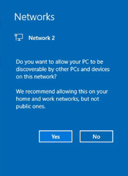
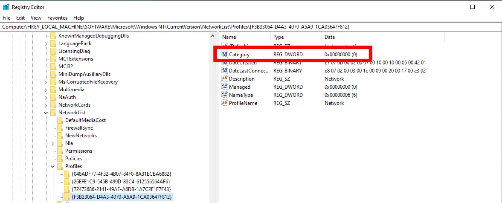
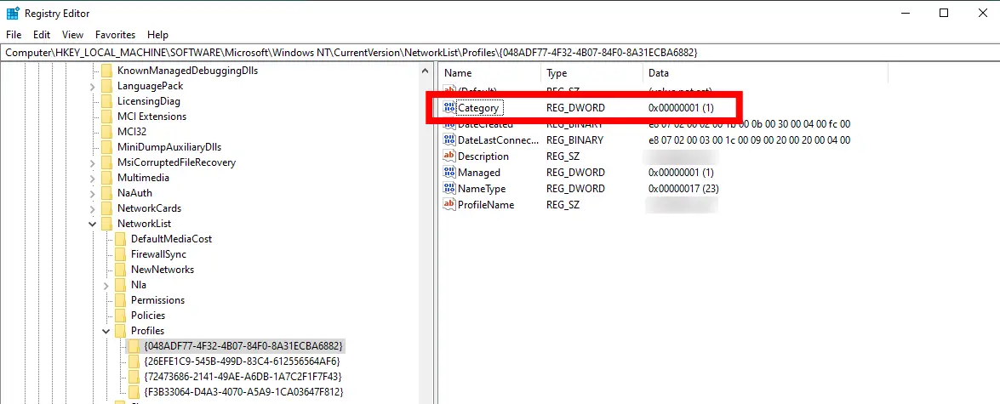
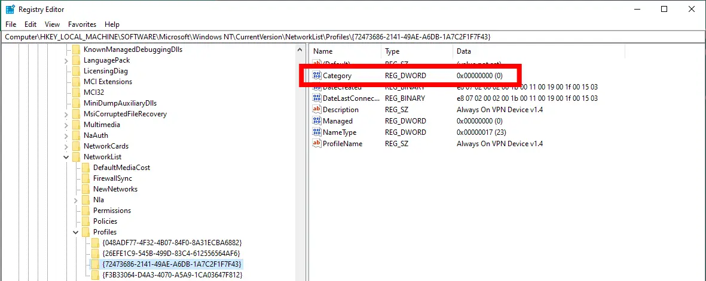
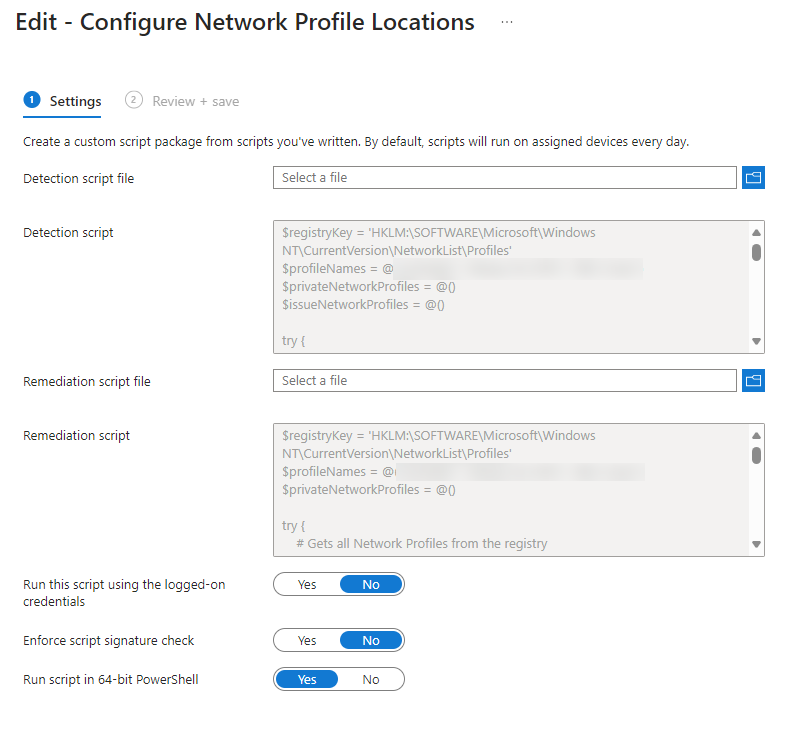
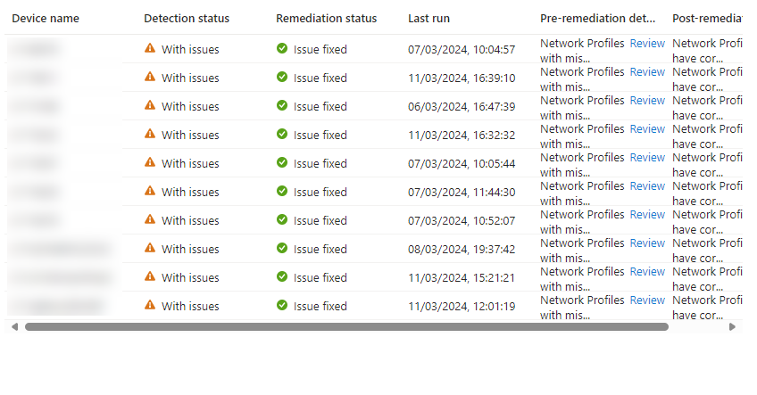
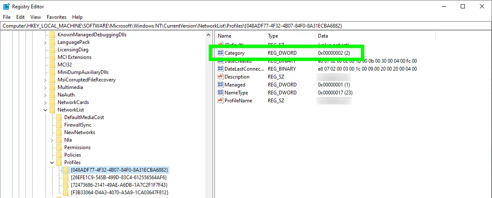
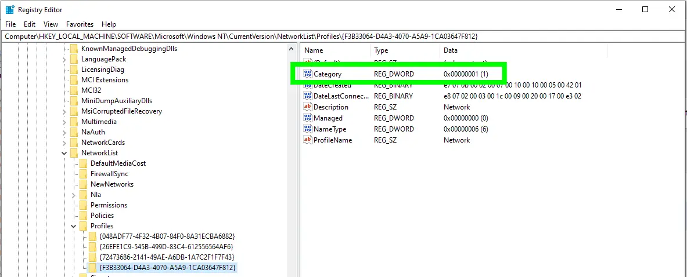
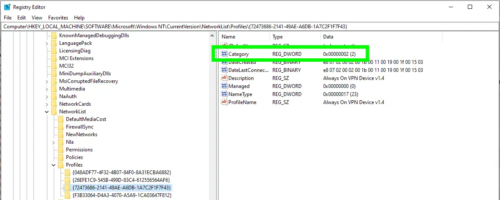

# Updating Windows Network Profile Locations with PowerShell


Oh I how love the ~Windows~ ~Defender~ Windows Firewall, and all the restrictions it brings. This time in the world of customers with aggressive firewall policies, we have Group Policy and Microsoft Intune applied firewall rules, only allowing inbound and outbound network traffic when on Private and Domain networks.

This you think shouldn't be such an issue, but it is in general and particularly during Windows Autopilot deployments.

What happens when a user doesn't select **'Yes'** to the below notification prompt, or just plain ignores it?



That's right, the network they've connected to gets marked as *Public*, how fun.

What about VPN profiles that don't work out that they are technically on a Domain network? Yeah that's a thing as well.

## Network Profiles

We could do with a way to tell these networks what network profile, and corresponding firewall settings they should be associated with, and luckily, through the power of the registry we can.

### Network Category Settings

If you go an have a look at your own registry under the key:

```powershell
HKLM:\SOFTWARE\Microsoft\Windows NT\CurrentVersion\NetworkList\Profiles
```

You'll see a whole host of network profiles stored under GUIDs, just like the below:



What you might notice is that each of the profiles has a category associated with it, in the above example it's **0**, which based on a quick ~Google~ Bing search and changing the values and watching the status of the network profile flip, correspond to the below settings.

| Category Value | Associated Network Profile |
| :- | :- |
| `0` | Public |
| `1` | Private |
| `2` | Domain |

Well that's pretty handy.

Go try it yourself, update the value and watch the associated Network Profile switch...I'll wait.

Welcome back 🤚, so we have a way to tell a network what profile it should have, now we need a way to identify which networks should be Domain and which should be Private.

### Targeting Network Profiles

We can pull back all the network profiles from the registry key using something like this:

```PowerShell
$registryKey = 'HKLM:\SOFTWARE\Microsoft\Windows NT\CurrentVersion\NetworkList\Profiles'
$regNetworkProfiles = Get-ItemProperty -Path $registryKey\* -ErrorAction Stop
```

And foreach-ing our way through the `$regNetworkProfiles` variable, we can go and change the value of **category** to either Private (**1**), or Domain (**2**) with something like the below:

```PowerShell
foreach ($regNetworkProfile in $regNetworkProfiles) {
  Set-ItemProperty -Path $regNetworkProfile.PSPath -Name 'Category' -Value 1 | Out-Null # Private Profile
}
```

Great, easy bit sorted.

We however, need to identify which profiles should be Domain, and which should be Private. I'm taking the stance that named profiles, well at least ones that we know about, so Domain based and corporate wireless networks are probably going to be Domain profiles, and all else will be Private.

With each of the network profiles having a **ProfileName** we can use this to target the assignment of the correct profile type.

Bare with me on this one, as it isn't pretty.

### Network Profile Logic

Because our selection of should be Domain based profiles have wonderful names like **odds.lan** and **odds.lan 2**, as well as all flavours of **Always On VPN User Tunnel** and **Always On VPN Device Tunnel**, and corporate wireless networks like **Corp-WiFi2G** and **Corp-WiFi5G** we need a way to target those with a Domain profile setting.

So we're going to use wildcards in an array variable `$profileNames`, please don't come for me.

```PowerShell
$registryKey = 'HKLM:\SOFTWARE\Microsoft\Windows NT\CurrentVersion\NetworkList\Profiles'
$profileNames = @('odds.*', 'Always On VPN*', 'Corp-WiFi*')
```

And because we are using wildcards, we're going to have to deal with some reverse logic, binning off any network profile in the registry to a new variable `$domainNetworkProfiles` that matches one of the profile names in `$profileNames` and then adding the other networks to a new array variable `$privateNetworkProfiles` if it doesn't existing in `$domainNetworkProfiles`.

I don't like it either, but it works.

```PowerShell
$registryKey = 'HKLM:\SOFTWARE\Microsoft\Windows NT\CurrentVersion\NetworkList\Profiles'
$profileNames = @('odds.*', 'Always On VPN*', 'Corp-WiFi*')
$privateNetworkProfiles = @()

# Loops through all profiles and determines whether the exist in the $profileNames wildcard array
foreach ($regNetworkProfile in $regNetworkProfiles) {
    $domainNetworkProfiles = $profileNames | Where-Object { $regNetworkProfile.ProfileName -like $_ }

    if (-not $domainNetworkProfiles) {
        $privateNetworkProfiles += $regNetworkProfile
    }
}

foreach ($regNetworkProfile in $regNetworkProfiles) {
    # Private Network Profiles
    if ($privateNetworkProfiles.ProfileName -contains $regNetworkProfile.ProfileName) {
        Set-ItemProperty -Path $regNetworkProfile.PSPath -Name 'Category' -Value 1 | Out-Null # Private Profile
    }
    # Domain Network Profiles
    else {
        Set-ItemProperty -Path $regNetworkProfile.PSPath -Name 'Category' -Value 2 | Out-Null # Domain Profile
    }

}
```

Which now gives us the ability to set Domain profiles that match items in `$profileNames` with the Domain profile, and all others with the Private profile.

Good, but how do we deploy this.

## Microsoft Intune Remediations

Good question earlier me ⏰, despite a  using [Platform Scripts](https://learn.microsoft.com/en-us/mem/intune/apps/intune-management-extension) to blindly configure settings, this one we're going to utilise [Remediations](https://learn.microsoft.com/en-us/mem/intune/fundamentals/remediations), so we need a way to capture and detect whether the existing profiles are correctly configured.

### Detection Script

With that in mind, may I present to you a much less janky detection method, with any network profile not configured to be either Domain or Private, being added to a new array variable `$issueNetworkProfiles` which at the end, we're just going to see if it contains anything.



If the outcome of `$issueNetworkProfiles.count -eq 0` is true, then we're all good and can end the process there, otherwise we'll throw an `Exit 1` to tell Microsoft Intune to run a remediation script.

### Remediation Script

Speaking of which, and building upon the previous script used to test the theory, we can include some error handling, and the required [exit codes](https://learn.microsoft.com/en-us/mem/intune/fundamentals/remediations#script-requirements) for remediations.



No, the remediation script didn't get any prettier.

### Deployment Outcome

Before we deploy these scripts using Microsoft Intune, we can look at the network profiles on a sample device, with each profile currently having the incorrect category assigned:






Configure the remediation in Microsoft Intune like the below:



Make sure you actually assign this to your devices, I'd recommend a daily schedule to ensure that any new networks are picked up by the remediation.

After a while, you should start seeing devices check in and remediate:



Looking back on our sample device in the registry, we can see that the networks have updated to the correct locations:







With the profiles with names in our `$profileNames` variable now updated to be Domain profiles, and all others set to Private. Now our devices can actually process the correct firewall rules, and get access to the required endpoints.

## Summary

Yes this might not be the best way to go about configuring these network profiles, and the [remediation scripts](https://github.com/ennnbeee/oddsandendpoints-scripts/tree/main/Intune/Remediation/NetworkProfileLocation) could be updated to only apply the Domain profile settings to the nominated profiles, but in the real world, users don't click things they should, so to mitigate this, the assignment of a Private profile to all other networks makes a lot of sense, especially when traffic is only allowed through VPN tunnels and corporate proxies.

