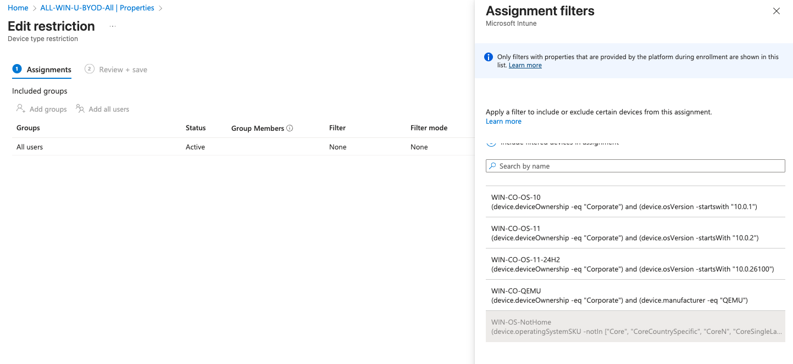
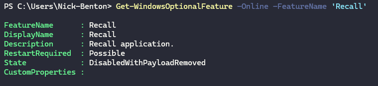
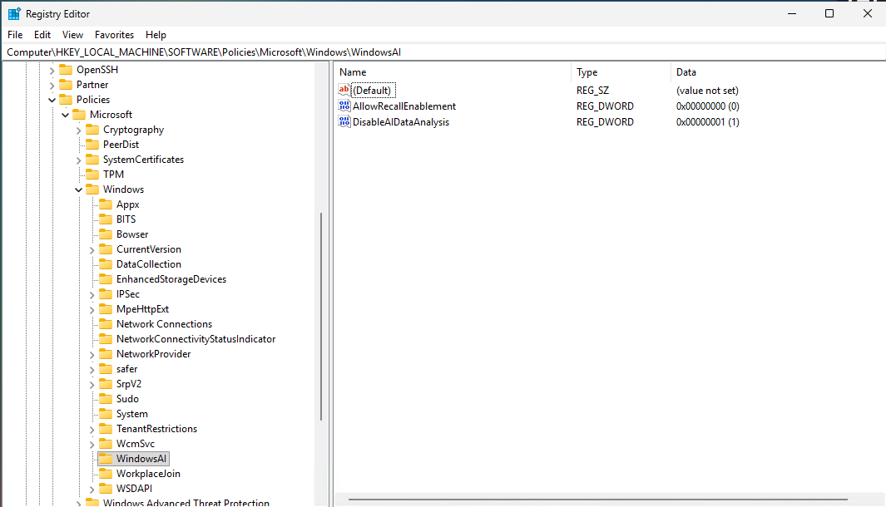
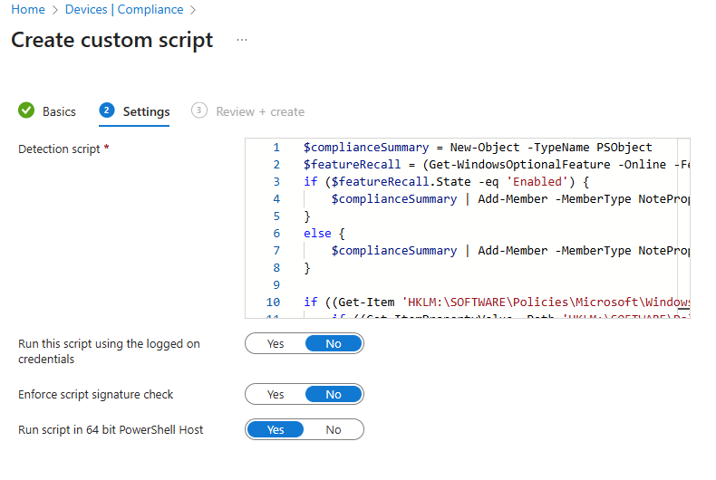
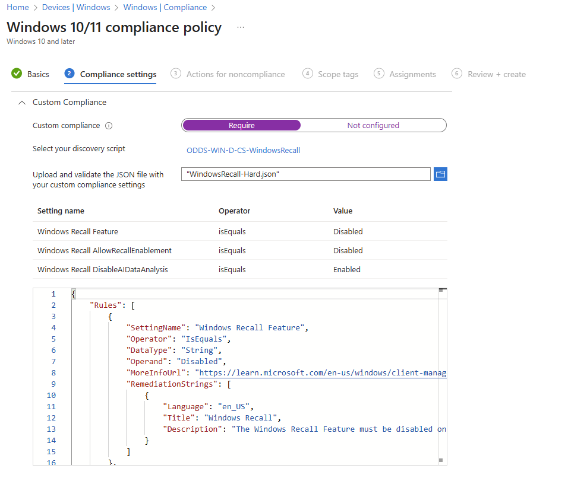
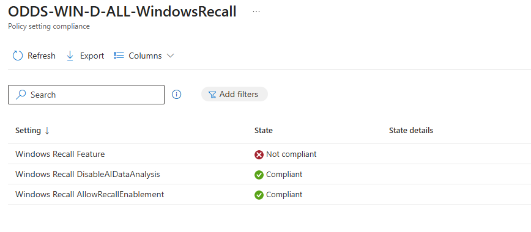
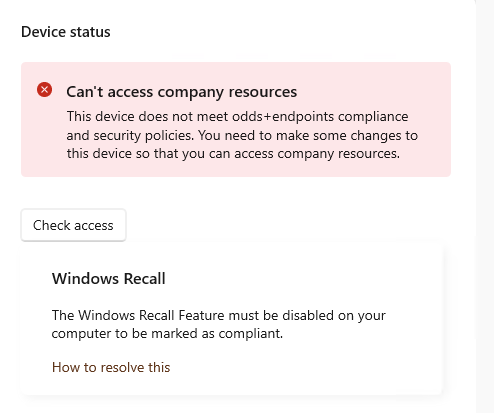

# Blocking Windows Recall Enabled Managed Devices


I'm not a fan of scaremongery when it comes to privacy and AI functionality, especially Microsoft Copilot AI features; but I am aware that with all the [configuration options](https://learn.microsoft.com/en-us/windows/client-management/manage-recall) you have at your fingertips with Intune to limit what AI features for Windows Recall can be used on managed devices, there is still a security concern with data that is captured and stored, or even accessed.

So what do we do about the [Windows Recall](https://support.microsoft.com/en-gb/windows/retrace-your-steps-with-recall-aa03f8a0-a78b-4b3e-b0a1-2eb8ac48701c) functionality that records your screen, on both corporate owned and BYOD devices.

## Disable Windows Recall

Well Windows Recall is disabled and removed on commerical devices by default at least, but let's just make doubly sure and enforce this setting using Intune, and pushing out this new policy to all devices, because you know, fear 👻.

| Category | Setting | Value |
| :- | :- | :- |
| Windows AI | [Allow Recall Enablement](https://learn.microsoft.com/en-us/windows/client-management/mdm/policy-csp-windowsai#allowrecallenablement) | `Recall is not available` |
| Windows AI | [Allow Recall Export](https://learn.microsoft.com/en-us/windows/client-management/mdm/policy-csp-windowsai#allowrecallexport) | `Deny export of Recall and snapshots information` |
| Windows AI | [Disable AI Data Analysis](https://learn.microsoft.com/en-us/windows/client-management/mdm/policy-csp-windowsai#disableaidataanalysis) | `Disable Saving Snapshots for Windows.` |

What if, just what if, someone with Administrator permissions goes and changes these settings or even enables the feature. What do we do then?


Commercial devices are defined as devices with an Enterprise (ENT) or Education (EDU) SKU or any premium SKU device that is managed by an IT administrator (whether via Microsoft Endpoint Manager or other endpoint management solution), has a volume license key, or is joined to a domain. Commercial devices during Out of Box Experience (OOBE) are defined as those with ENT or EDU SKU or any premium SKU device that has a volume license key or is Microsoft Entra joined.


## Device Compliance

We mark them as non-compliant and block then with a Conditional Access policy, next.

Ok, we should expand on this a little bit, [Custom Compliance](https://learn.microsoft.com/en-us/intune/intune-service/protect/compliance-use-custom-settings) allows additional checks on Windows (and Linux) devices, that native compliance checks don't support.

Essentially, if you can script something self-contained (i.e., it isn't calling external web services or apis for information) that will run on the device in the SYSTEM or User context, to pull back information from the device, you can use that to determine whether a device is going to be marked as compliant or non-compliant.


If you want a breakdown of Custom Compliance check out [Florian Salzmann's](https://www.linkedin.com/in/fsalzmann/) [post](https://scloud.work/custom-compliance-windows-intune/) which includes details of supported operators and examples.


We've used Custom Compliance with Third-Party Antivirus products [previously](/posts/custom-compliance-third-party-av/), so let's look at what we need to detect to understand whether someone on a corporate device has somehow enabled Windows Recall, or someone using BYOD device already has enabled it on their [Copilot+ PC](https://blogs.microsoft.com/blog/2024/05/20/introducing-copilot-pcs/).

## Device Platform Restrictions

"*Oh but Custom Compliance only works on Windows Pro and above, what about Windows Recall running on Windows Home?*", I hear you whinge.

Yeah, you're not wrong, Custom Compliance *is* only supported on [Windows excluding Windows Home](https://learn.microsoft.com/en-us/intune/intune-service/protect/compliance-use-custom-settings), and Windows Recall has vague enough [pre-requisites](https://learn.microsoft.com/en-us/windows/client-management/manage-recall#system-requirements) to make you think it shouldn't support Windows Home, but in fact it does (ish).

Have you thought about ~ab~using [Device Platform Restrictions](https://learn.microsoft.com/en-us/intune/intune-service/enrollment/create-device-platform-restrictions) and [Assignment Filters](https://learn.microsoft.com/en-us/intune/intune-service/fundamentals/filters) to block the enrolment of Windows Home devices though?

Easy enough to implement, but a bigger question on whether you would want to, either way I want to as it's not like you can really manage Windows Home devices anyway 😂.

Go create a new Windows Assignment Filter with the below rule, which will basically include all non-home editions of Windows #logic.

```SQL
(device.operatingSystemSKU -notIn ["Core", "CoreCountrySpecific", "CoreN", "CoreSingleLanguage"])
```

Then go amend your Device Platform Restriction policy that allows BYOD, and apply the new filter.



Now with BYOD Windows Home editions blocked from enrolment, we can sleep safe at night (well after you remove all existing Windows Home BYOD devices from Intune 😶).


There isn't the option to use an exclude filter mode in the web interface at least, hence the use of `notIn` in the filter.


## Detection Methods

Back to Windows Recall and compliance.

Short of detecting whether the Windows Recall settings we configured using Intune have applied correctly, what else do we need to check on the device to be sure Windows Recall isn't ~snooping and listening~ working in the background.

Three things really, and all can be used in a Custom Compliance policy to understand whether **any** or **all** or the Windows Recall settings are enabled depending on your approach:

- Whether the **Windows Recall Feature** itself is installed
- Whether the corresponding registry setting for **Allow Recall Enablement** has been set
- Whether the corresponding registry setting for **Disable AI Data Analysis** has been set

Pretty straightforward really, just a bit of PowerShell to work out whether the feature is installed and whether the registry settings exist and are set to the correct values.

### Windows Recall Feature

We can work out whether the feature itself is installed using a simple one-liner.

```PowerShell
Get-WindowsOptionalFeature -Online -FeatureName 'Recall'
```

With the results of the above allowing us to query the `state` property as to whether Recall is installed or not.



### Windows Recall Registry Entries

Both 'Allow Recall Enablement' and 'Disable AI Data Analysis' registry settings exist in the same key in the registry `HKLM:\SOFTWARE\Policies\Microsoft\Windows\WindowsAI`, meaning that we can just query the below two settings and their values to ensure that Windows Recall is disabled.

- `AllowRecallEnablement` equal to `0`
- `DisableAIDataAnalysis` equal to `1`




I am aware that `DisableAIDataAnalysis` also exists in the Current User Registry Hive, but if we're going to use Custom Compliance on BYOD as well as corporate owned Windows devices, we might struggle getting [user context](https://learn.microsoft.com/en-us/intune/intune-service/protect/compliance-use-custom-settings#prerequisites) scripts to work due to certain limitations.

Plus we're still detecting if the Windows Recall feature is installed, so ~do one,~ ~get off my back~ there we go 😅.


## Custom Compliance

Now we know what can be queried to understand whether Windows Recall is enabled on a device or not, we can create a [discovery script](https://learn.microsoft.com/en-us/intune/intune-service/protect/compliance-custom-script) with these detection methods to be used for a Custom Compliance policy.

### Discovery Script

The below [script](https://github.com/ennnbeee/oddsandendpoints-scripts/blob/main/Intune/Compliance/Custom/WindowsRecall/WindowRecall-Hard.ps1) discovers whether the Windows Recall feature is installed, and the registry keys exist, and are set to the correct values, and presents back a JSON object that Intune can use for validation.



Which when running from an elevated PowerShell prompt should give us a happy outcome.

```JSON
{"Windows Recall Feature":"Disabled","Windows Recall AllowRecallEnablement":"Disabled","Windows Recall DisableAIDataAnalysis":"Enabled"}
```


I've gone very cautious with the script (mainly due to the User Registry settings we can't query), and regardless of whether the Windows Recall is enabled or disabled, if the registry keys don't exist disabling the functionality, then the device will be marked as non-compliant.


### JSON Validation

With a discovery script, we also need a corresponding [JSON file](https://learn.microsoft.com/en-us/intune/intune-service/protect/compliance-custom-json) to ensure that we can check the data captured by the discovery script against our benchmark for device compliance.



This [JSON file](https://github.com/ennnbeee/oddsandendpoints-scripts/blob/main/Intune/Compliance/Custom/WindowsRecall/WindowsRecall-Hard.json) not only allows for validation of the settings, but also what information is displayed to the end users in the Company Portal when their device is marked as non-compliant, friendly 😇.

### Compliance Policy

With all we need at our disposal, head into Intune and navigate to **Devices > Manage Devices > Compliance > Scripts** and add our discovery script for **Windows 10 and later** devices.



Now just to create the Compliance Policy to use the script we created, and upload the JSON file for validation.



All is left is to deploy the script to your chosen groups of devices, for me this is all of them, and sit back and [wait](https://learn.microsoft.com/en-us/intune/intune-service/protect/compliance-use-custom-settings#after-an-issue-on-a-device-is-fixed-subsequent-syncs-dont-identify-the-issue-as-resolved-and-compliant) for the results to come in...



With the polite notice configured in the JSON file, users at least get told in the Company Portal why they're being marked as non-compliant, with a nice link telling them how to fix it.



Once we're happy that the compliance policy is applying as expected and marking devices as non-compliant where Windows Recall is enabled, you can ~blindly~ create a [Conditional Access Policy](https://learn.microsoft.com/en-us/entra/identity/conditional-access/policy-all-users-device-compliance) to require Device Compliance, blocking devices that are non-compliant, now including those with Windows Recall or associated settings enabled.

## Summary

We should be embracing AI even if it *will* come for all our jobs eventually, or write blog posts about Intune for us 👀.

For now though we should be ~combatting our AI overlords~ conscious of the use of AI functionality on corporate owned devices, or devices accessing corporate data held in Microsoft services, and putting in place suitable controls to manage or mitigate the use things like Windows Recall.

Luckily for you, me and my mate Microsoft have the functionality to both limit the use of Windows Recall or just full on block devices where Windows Recall is enabled.

Shout out to [Petr Pospíšil](https://www.linkedin.com/in/petr-pospisil111/) whose [LinkedIn post](https://www.linkedin.com/posts/petr-pospisil111_windows-recall-overprivileged-activity-7387814465817178112-vQsh?utm_source=share&utm_medium=member_desktop&rcm=ACoAAAIrTrgB3O-zXDndCm5jau1yOL81a0hcwRE) got me annoyed enough to write this blog post 😘.

